# myFirstDynamicBlog

## 프로젝트 목표

*github.io를 동적으로 내가 만들어보자 !!*


는 실패이다... 깃허브는 정적 페이지만 허용한다.....

## 프로젝트 배경

TIL을 입력하다 보니 블로그를 만들고 싶어졌다.
기존 템플릿을 가져다 쓰면 할 수 있지만 내가 공부도 할 겸 조금 더 멋있게 만들어 보자 !!

https://nachwon.github.io/django-2-start/ 이곳을 따라가면서 진행해보자

## 프로젝트 진행과정

Django를 설치하고 

터미널에

```
 django-admin start startproject myproject
```

를 입력한다

그 후 

```
python mange.py runserver
```

를 입력하여 정상작동되는지 확인한다.

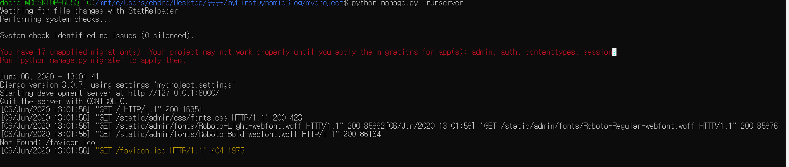

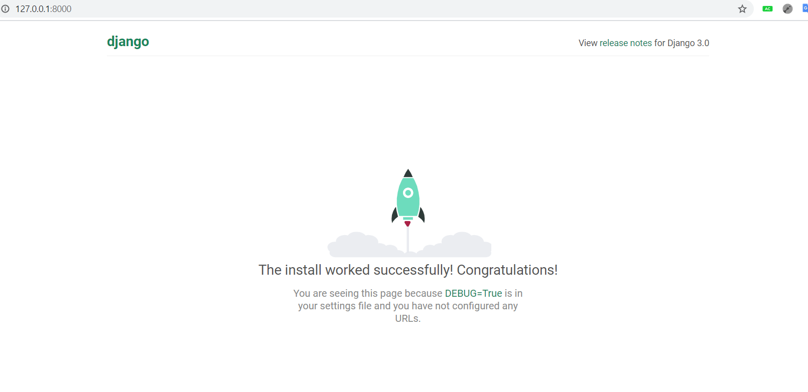

## 앱

앱(Application)은 Django 에서 사용하는python 패키지이다.


### 앱 생성하기

```
python manage.py startapp 앱이름
```

앱이름의 폴더가 생성된다.

이를 

`settings.py`

에 추가하여 액티브 상태로 만들어주자

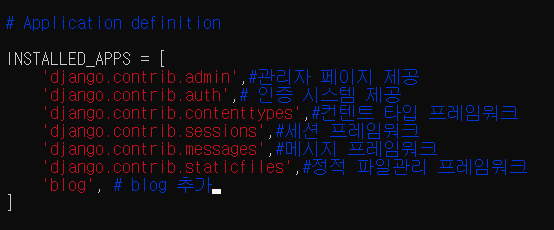

앱을 만들었다.

이제 안에 내부를 만들자.

그에 앞서 내부를 구성하는

모델, 템플릿 ,뷰에 대해 알아보자

## MVC 패턴

#### Model-View-Controller (MVC)

어떤 앱이 모델, 뷰, 컨트롤러로 구성되도록 개발하는 방법을 MVC 패턴이라 한다.

**모델** : 데이터베이스나 파일 등의 데이터 소스를 제어한다.

**뷰** : 모델로부터 제공된 데이터를 반영하여 사용자에게 보여주는 부분이다.

**컨트롤러** : 사용자의 요청을 파악하여 그에 맞는 데이터를 모델에 의뢰하고, 그것을 뷰에 반영하여 사용자에게 제공한다.

## MTV 패턴

장고는 **MTV패턴**으로 

View가 Template으로 대체되었다.

모델은 데이터를 표현하는데 사용되며, python 클래스 형식으로 정의된다.

템플릿은 사용자에게 보여지는 부분만을 담당한다.

뷰는 http request를 받아 http response를 리턴하는 컴포넌트로, 모델로부터 데이터를 읽거나 저장할 수 있다.


## 모델 만들기

먼저 블로그 앱의 모델을 만들어 보자

모델은 데이터에 대한 정보를 담고있으며, 데이터베이스와 직접적으로 연결된다.

- 모델은 python 클래스이며, `django.db.models.Model` 클래스를 상속받는 서브클래스이다.

- 모델 클래스의 속성들은 데이터베이스의 필드가 된다.

- Django 는 모델 클래스를 통해 데이터베이스에 접근할 수있는 API를 자동적으로 생성해준다.

- 모델은 blog 폴더 내의 models.py 파일에 클래스 객체를 생성하여 만들 수 있다.

- ex)models.py

- ```python
  from django.db import models
  from django.conf import settings
  # Create your models here.
  class Post(models.Model):
      author = models.ForeignKey(settings.AUTH_USER_MODEL, on_delete=models.CASCADE)
      # 필드를 외래키로 만들며 다른테이블과 연결됨을 뜻한다.
      # 기본적으로 AUTH_USER_MODEL은 내장되어있다.글들을 작성자 목록과 연결한것
      # CASCADE는 재귀적 관계 명시
      title = models.CharField(max_length=100)
      # 글 제목 CharFiled는 글자 수가 제한된 텍스트 필드를 뜻한다. 글제목과 같이 짧은 문자열 정보를 젖아할때 사용한다.
      # 100자까지허용한다.
      content = models.TextField(blank=True)
      # 글 내용, blank옵션은 비어있는경우 처리하는가이다.
      created_date = models.DateTimeField(auto_now_add=True)
      # 글 작성날짜
      published_date = models.DateTimeField(blank=True, null=True)
      # 글 게시 날짜auto는 처음 생성될때 시간 자동저장
      # null은 비어있는값을 데이터베이스에 Null로 저장할지 여부
  
  ```


## 데이터베이스

### Migrations

Migrations은 Django의 모델에서 설정한 데이터베이스의 테이블 구조를 데이터베이스에 적용시키기 위한 기록으로 볼 수 있다.

admin, auth, contenttypes, sessions등과 같은 앱들은 데이터를 저장할 공간이 필요한 작업을 수행하는 앱들이며, 따라서 데이터베이스에 데이터들이 저장될 테이블이 있어야 한다.

Migrations  : 데이터베이스 구조를 기록

migreate : 이를 데이터베이스에 적용

### SQLite

Django는 데이터베이스의 하나인 SQLite를 포함하고있다.

이는 settins.py에서 설정해줄수 있고, 기본적으로 SQLite3을 설정하도록 되어있다.

### Migreate

```
python manage.py migrate
```

입력


이제 runserver을 해도 빨간글씨가 나오지않는다.

SQLite Brower을 써서 데이터베이스를 GUI에서 다루자

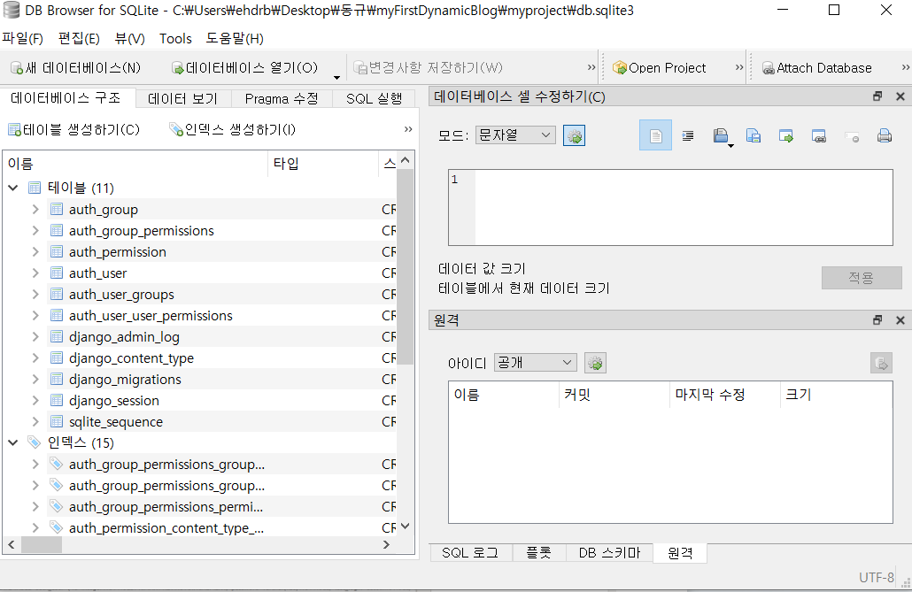

Migration 만들기

데이터베이스에 변화가 생기면 이를 기록해야한다.

```
./manage.py makemigrations 앱이름
```

이를 입력해 변경사항을 기록하자

blog 폴더에 migrations 폴더가 생겼고 그안에 initial.py파일이 생겼다.

이제 이파일을 migrate를 하자

```
./manage.py migrate blog
```

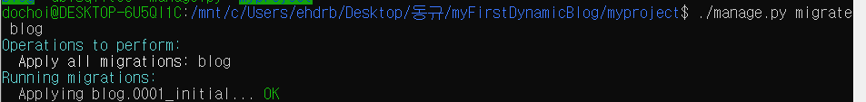

sqlite로 획인해보자


필드로 들어갔다.

### 데이터베이스 스키마 확인하기

데이터베이스는 sql을 통해 관리된다. migrate 명렁어는 python으로 작성된 데이터베이스 변경사항을 sql로 번역해주는 역할을 한다고 볼 수 있다.

```
./manage.py sqlmigrate 앱이름 migration번호
```

이 명령어로 migration이 migrate될 때 실제로 실행되는 sql 명령어를 확인할 수 있다.

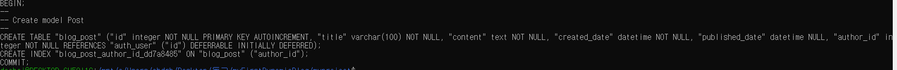

우리가 만든 모델이 가지는 구조의 테이블을 데이터베이스에 기록하는 sql 명령어들을 확인할 수 있다. 이렇게 데이터베이스의 자료구조, 자료간 관계를 정의해놓은것을 데이터베이스 스키마라고 한다.

### 관리자페이지

데이터베이스에 접근하여 데이터를 생성하거나 삭제하려면 관리자 기능이 필요합니다.

django는 이러한 기능을 제공합니다.

### 모델등록

관리자 페이지는 admin.py파일에서 등록합니다. 우리가 blog 앱을 만들었을때 settings.py에 등록하여 프로젝트에 사용할 수 있도록 했던 것 처럼, 우리가 만든 Post 모델을 관리자 페이지를 통해 사용하려면 admin.py에 등록해주어야 한다.

admin.py를 수정합니다.

```python
from django.contrib import admin
from blog.models import Post# models.py에서 Post 모델을 가져온다.
# Register your models here.

admin.site.register(Post) # Post를 관리자 페이지에 등록한다
```


이제 들어갈 수 있다.

여기에 로그인하려면 사용자 등록을 해야한다.

```
./manage.py createsuperuser
```

입력


이제 로그인이 가능하다.

### 관리자 페이지에서 데이터 추가하기

관리자 페이지를 이용하여 블로그에 글을 올려보자

관리자 페이지 메인화면에서 add 를 눌러 post를 작성할 수 있다.

post를 쓰고보니 시간이 다르다 시간을 대한민국 시간으로 바꿔주자

settings.py

```python
TIME_ZONE = 'Asia/Seoul'
```

언어도 바꿔주자

```python
LANGUAGE_CODE = 'ko-kr'
```

### Post 제목 보이게 하기

```python
 def __str__(self):
        return self.title
```

Post class에 이를 추가하자

새로운 글을 쓸때마다 관리자 페이지에 접속하지 않도록 블로그를 좀더 아름답게 만들어보자

## 뷰

지금까지 post 모델을 만들고 관리자 페이지를 통해서 Post 데이터를 생성해보았다.

지금 우리 블로그를 들어가면 무엇이 나오는가?


이게 블로그인가?

이는 그냥 알림판이다.

Post로 글을 작성했기 때문에 어딘가엔 작성한 글이 존재할것이다.

이 데이터를 가져와서 보여주는것이 view이다.

django는 뷰를 views.py 파일을 통해 관리한다. models.py에 모델을 추가해준것처럼

view.py에도 뷰를 추가해서 뷰를 활성화하자

view.py

```python
from django.shortcuts import render
from django.http import HttpResponse
# Create your views here.
def helloworld(request):
    return HttpResponse("hello world!")
```

request를 인자로 받아서 hello world라는 문자열을 돌려준다.

이제 이 뷰에 사용자들이 request 를 보낼 수 있도록 URL 주소를 할당해주자

### URL 설정

django는 각 기능의 RUL 주소를 urls.py로 관리한다.

urlpatterns 라는 리스트가있고 rul 객체가 하나 들어있다.

```python

urlpatterns = [
    path('admin/', admin.site.urls),
]

```

url객체는 두개의 인자를 받는다.

```python
url(정규표현식, 뷰)
```


첫번째 인자는 정규표현식이며, 해당 정규표현식과 매치가 되면 두번째 인자로 받은 뷰를 실행시킨다.

django가 request를 받았을 때 처리하는 과정

한 사용자가 django 웹 페이지를 호출하면 django는 아래의 과정을 거친다.

1. 어떤 URLconf 모듈을 사용한지 결정한다. 우리의 경우 config.urls이다.
2. 해당 URLconf모듈에서 urlpatterns라는 리스트 객체를 찾는다. 이 리스트는 django.conf.urls.url()의 인스턴스가 들어있다.
3. 이 urlpatterns 리스트를 순회하면서 각 객체가 가진 정규표현식을 호출된 웹페이지의 URL 주소와 매칭시킨다.
4. 정규표현식들 중 하나와 매치가 되는 순간 순회를 멈추고 매치된 정규표현식을 가진 url 객체의 view를 실행시킨다.
5. 만약 매칭되는 정규표현식이 없거나, 어떤 다른 예외가 이 과정중에 발생할 경우 상황에 적합한 에러 메시지를 리턴한다.


localhost:8000/admin/

여기서 관리자 페이지를 볼 수 있던것은 URL 주소가 정규표현식 주소와 매칭되어 admin.site.urls라는 뷰를 실행하게 되고 뷰에서 response로 관리자 페이지를 리턴해 준것이다.

이제 helloworld뷰에 url 주소를 할당해보자

```python
urlpatterns = [
    path('admin/', admin.site.urls),
    path('',helloworld)
]

```


성공이다. !!


## 템플릿

원하는 내용을 원하는 주소에 표시하는 방법을 알았다.

hello world!만 출력해서 무엇을 하겠는가.

이제 이것을 꾸며보자

templates라는 디렉토리를 만들자

여기에 간단한 html파일을 만들어 보자

```html
<!doctype html>
<html lang="en">
<head>
    <meta charset="UTF-8">
    <meta name="viewport"
          content="width=device-width, user-scalable=no, initial-scale=1.0, maximum-scale=1.0, minimum-scale=1.0">
    <meta http-equiv="X-UA-Compatible" content="ie=edge">
    <title>Hello World Template</title>
</head>
<body>
    <h1>Hello World!</h1>
</body>
</html>
```

간단한 템플릿 파일이 생성되었다. 이 파일을 뷰를 통해 출력해보자.

### 템플릿 경로 설정하기

뷰에서 템플릿을 출력하려면 Django에게 템플릿 폴더의 위치를 알려주어야 한다.

settings.py를 수정하자

```python
BASE_DIR = os.path.dirname(os.path.dirname(os.path.abspath(__file__)))
```

BASE_DIR은 이 프로젝트의 루트 디렉토리이다.

os.paht.abspath는 settings.py의 절대경로이며

os.path.dirname은 인자로 받은 객체가 포함된 경로를 나타내준다.

따라서 BASE_DIR은 setting.py의 절대경로가 포함된 경로인 myproject 폴더의 경로를 포함하는 myproject 폴더를 가리키고 있다.


```python
TEMPLATE_DIR = os.path.join(BASE_DIR, 'templates')
```

BASEDIR에 templates를 붙인

myproject/templates가 된다.

```python
TEMPLATES = [
    {
        'BACKEND': 'django.template.backends.django.DjangoTemplates',
        'DIRS': [
            TEMPLATE_DIR
        ],
        'APP_DIRS': True,
        'OPTIONS': {
            'context_processors': [
                'django.template.context_processors.debug',
                'django.template.context_processors.request',
                'django.contrib.auth.context_processors.auth',
                'django.contrib.messages.context_processors.messages',
            ],
        },
    },
]
```

이를 추가해주자

### 템플릿 출력하기

이제 뷰에서 templates폴더에 있는 파일을 불러와 출력하자

```python
from django.shortcuts import render
from django.http import HttpResponse
# Create your views here.
def helloworld(request):
    return render(request, 'blog/helloworld.html')
```

view 파일을 수정하였다.

render 함수는 두개의 인자를 필수로 받는다.

첫번 째인자는 request이고, 두번째 인자로 출력할 템플릿 파일을 받는다.

옵션으로 세번째 인자에 데이터들이 들어있는 딕셔너리 자료형을 받는다.

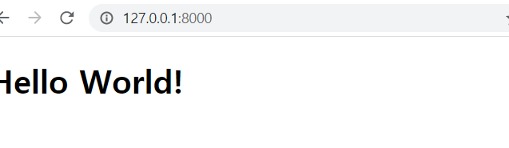

hello world가 커졌다

### ORM

동적으로 템플릿을 만드려면 ORM에 대해 알아야 한다.

ORM(Object Relational Mapping ORM)

ORM은 데이터베이스와 객체 지향 프로그래밍 언어 간의 호환되지 않는 데이터를 변환하는 프로그래밍 기법이다. 객체 관계 매핑 이라고도 부른다. 객체 지향 언어에서 사용할 수 있는 "가상" 객체 데이터베이스를 구축하는 방법이다. 객체 관계 매핑을 가능하게 하는 상용 또는 무료 소프트웨어 패키지들이 있고, 경우에 따라서는 독자적으로 개발하기도 한다.


데이터베이스는 sql을 통해 관리된다. orm은 데이터를 하나의 객체로보고 sql문과 호환해주는 역할을 해준다. 데이터베이스의 테이블은 orm을 통해 모델로 표현되고, 하나의 데이터 즉, 레코드는 하나의 객체로 취급된다.

### shell_plus 설치

ORM을 위해서 개발환경을 구축해야 한다.

django_extensions와 ipython을 설치하자

settings.py INSTALLED_APPS에 django_extensions를 추가해주자

```python
INSTALLED_APPS = [
    'django.contrib.admin',#관리자 페이지 제공
    'django.contrib.auth',# 인증 시스템 제공
    'django.contrib.contenttypes',#컨텐트 타입 프레임워크
    'django.contrib.sessions',#세션 프레임워크
    'django.contrib.messages',#메시지 프레임워크
    'django.contrib.staticfiles',#정적 파일관리 프레임워크
	'blog', # blog 추가 사용자앱
    'django_extensions', # 써드파티앱
]

```

이제 djnago 전용 shell을 쓸 수 있다. !!

mange.py로 가서

```
./manage.py shell_plus
```

를 입력하자


이렇게 된다. 여기서 테스트 코드를 작성하면 된다.

ex)

```python
Post.objects.all()
```


이런식으로 확인할 수 있다.

```
User.objects.all()
```


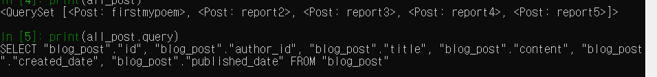

쿼리도 확인할 수 있다.(sql문이 궁금하다면)

### 객체생성하기

ORM을 이용하면 데이터베이스에 직접 접근하지 않아도 간단히 객체를 만들 수 있다.

```
Post.objects.create(author='nachwon', title='ORM Test', content='This is a test Post')
```

에러가 난다 이유는

author가 User 객체여야 한다.

User 객체를 만들자

```
me = User.objects.get(username='dochoi')
```

```
Post.objects.create(author=me, title='ORM Test', content='This is a test Post')
```

이제 된다.	

목록의 마지막에 ORM Test가 추가되었다.


sqlite에서도 확인해볼 수 있다.

### 객체 필터링하기

filter()를 사용하여 객체를 필터링 할 수 있다.

```
Post.objects.filter(title__contains='ORM')
```

```
Post.objects.filter(content__contains='blog')
```

```
Post.objects.filter(author=me)
```

각각 제목, 내용, 작성자를 검색해준다.

```
Post.objects.order_by('created_date')
```

```
Post.objects.order_by('-created_date')
```

-를 붙이면 역순 정렬이다.


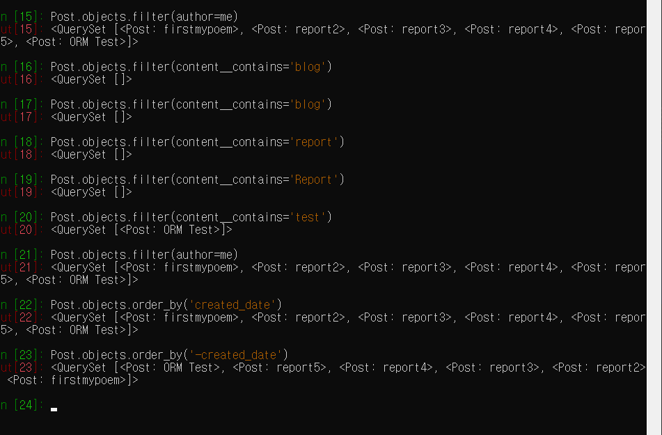

### 쿼리셋 필터 중복 적용

```
Post.objects.filter(title__contains='django').order_by('published_date')
```

### 객체 삭제하기

```
post = Post.objects.get(title='ORM Test')
```

```
post.delete()
```

객체를 삭제하면서 (삭제한 총 객채수, {삭제된 객체의 타입: 삭제된 해당 타입의 객체 수})를 리턴한다.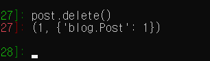

https://docs.djangoproject.com/en/1.11/ref/models/querysets/

## 템플릿언어

html 구조를 일일히 업데이트하기엔 번거롭다. 이를 편하게 해주는것이 템플릿 언어이다.

### 템플릿에 데이터 전달하기

메인화면에는 Post들의 목록을 보여줄 것이므로

views.py를 열어 helloworld 함수를 post_list 라는 함수로 바꿔주자.

urls.py, helloworld.html 파일의 이름도 바꿔주자.

```python
def post_list(request):
    return render(request, 'blog/post_list.html')
```

```python
from blog.views import post_list

urlpatterns = [
    path('admin/', admin.site.urls),
    path('',post_list)
]

```

```
helloworld.html -> post_list.html
```

view.py에 list를 추가해준다.

```python
from django.shortcuts import render
from django.http import HttpResponse
from blog.views import post_list

# Create your views here.
# def helloworld(request):
#     return render(request, 'blog/helloworld.html')
def post_list(request):
	post = Post.objects.all()# ORM을 통해 쿼리셋을 가져온다. 모든 Post가 나온다.
	context = {# context라는 변수에 할당한다. render 세번째 인자에 넣는다.
		'posts': posts,
	}
    return render(request, 'blog/post_list.html',context)

```

3번째 인자는 딕셔너리 타입의 데이터를 받는다.

템플릿 내부에서 템플릿 언어를 통해 이 딕셔너리 타입의 데이터의 키를 호출하여 데이터를 가져올 수 있다. !!

### 템플릿언어

이제 템플릿에 데이터를 전달했다. 이제 이 데이터를 호출해서 html 파일에 적용시켜보자

html에서 어떻게 키를 호출할 수 있을까 ..?

django에 내장된 템플릿 언어를 사용해야 한다.

```python
TEMPLATES = [
    {
        'BACKEND': 'django.template.backends.django.DjangoTemplates',
        'DIRS': [
            TEMPLATE_DIR
        ],
        'APP_DIRS': True,
        'OPTIONS': {
            'context_processors': [
                'django.template.context_processors.debug',
                'django.template.context_processors.request',
                'django.contrib.auth.context_processors.auth',
                'django.contrib.messages.context_processors.messages',
            ],
        },
    },
]

```

기본적으로 BACKEND에 언어가 설정되어있다.

### 변수호출

템플릿 언어에서 변수 호출은 아래와 같이 한다.

{{변수명}}

post_list.html을 수정하자


쿼리셋을 받아왔다.

### 객체 순회하기

이 쿼리셋은 Iterable이다. 

템플릿언어에서 이를 순회하기 위해 for문을 사용한다

```

    {{ 변수 }}

```

post_list.html에 body를 수정하자

```html
<body>
    <h1>Welcome to Che1's Blog!</h1>
    <ul>
        
        <li>
            <div class="title"><a href="">{{ post.title }}</a></div>
        </li>
        
    </ul>
</body>
```

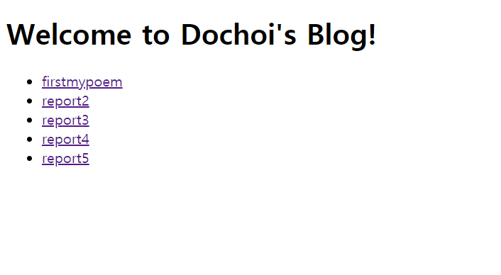

오호 뭔가 게시판 느낌이 난다.

for문으로 쿼리셋의 객체를 하나씩 순회하면서 Post 객체의 title 필드의 내용에 li, div, a 태그를 붙여준 것이다. 좀더 응용해서 글 내용을 보여줘보자.

```html
     <div class="title"><a href="">{{ post.title }}</a></div>
            <div class="content">{{ post.content }}</div>	
```


### 필터를 적용하자

나는 글을 적게적었지만 글이 길경우 조금만 나오게 해보자

```html
           <div class="content">{{ post.content|truncatewords:1  }}</div>
```

https://docs.djangoproject.com/en/1.11/ref/templates/builtins/#ref-templates-builtins-filters1

이곳에서 필터의 종류를 보자 truncatewords는 단어수 필터이다

### if 조건문

글 게시 날짜도 표시해보자

```html
  <div class="published-date">{{ post.published_date }}</div>
```

```html
        
        
        <li>
            <div class="title"><a href="">{{ post.title }}</a></div>
           <div class="content">{{ post.content|truncatewords:3  }}</div>
              <div class="published-date">{{ post.published_date }}</div>
        </li>
        
        
        
```

게시날짜가 없는건 표시안하기로 한다.

```

조건 1이 참인 경우 실행할 명령

조건 2가 참인 경우 실행할 명령
.
.
.

모든 조건이 거짓인 경우 실행할 명령

```

```python
 posts = Post.objects.filter(published_date__isnull=False).order_by('-created_date')  # 수정된 부분
```

이런식으로 view에서도 수정이 가능하다.

html보다 view에서 처리해주는게 훨씬 깔끔하다

## 스테틱 파일

이제 꾸며주는 일만 남았다.

이는 CSS를 이용한다

static 폴더 생성

CSS와 같은 파일을 static 파일이라한다

이것들은 static이라는 폴더에 모아놓고 관리하자

http://bootstrapk.com/getting-started/#download

여기서 일단 Bootstrap을 받아서 static폴더 안에 넣자

### static 폴더를 연결하자.

settings.py를 수정하자

```python
STATIC_DIR = os.path.join(BASE_DIR, 'static')
```

```python
STATIC_URL = '/static/'
STATICFILES_DIRS = [
    STATIC_DIR,
]

```

### css 파일을 적용하자

```html
<head>
    <meta charset="UTF-8">
    <meta name="viewport"
          content="width=device-width, user-scalable=no, initial-scale=1.0, maximum-scale=1.0, minimum-scale=1.0">
    <meta http-equiv="X-UA-Compatible" content="ie=edge">
    <link rel="stylesheet" href="">  # link 태그 삽입
    <title>Post_list</title>
</head>
```

이렇게 수정해준다.

link 태그의 href 속성에 적용하려는 정적 파일들의 경로를 설정해주어야 한다.

정적파일의 경로를 불러올때는  템플릿 태그를 사용한다.

 는 STATICFILE_DIRS 에 입력한 경로로 부터 시작해서

bootstrap/css/폴더 안에 bootstrap.css 파일을 가르킨다.

 태그는 기본적인 태그가 아니기 때문에 따로 불러와 주어야한다.

템플릿 파일 제일 윗 줄에 아래와 같이 입력하자

```

```


조금더 깔끔해졌다.

여기서 css파일과 html파일을 조금더 손대면 아래와 같이 꾸며진다.


**css가 업데이트가 안될땐, 캐시를 삭제해주자 !!**

### 자세히 보기 페이지 생성 !!

이제 저 글을 누르면 글이 튀어나오게 해보자 !!

views.py를 수정해주자

```python
def post_detail(request):
    post = Post.objects.first()
    context = {
        'post': post
    } 
    return render(request, 'blog/post_detail.html', context)
```

이 함수를 추가해준다.

.first()로 첫번째 Post 객체 하나를 할당하고, post를 딕셔너리로 post_detail.html 템플릿에 전달한다.

이제 html을 구성하자

```html

<!doctype html>
<html lang="en">
<head>
    <meta charset="UTF-8">
    <meta name="viewport"
          content="width=device-width, user-scalable=no, initial-scale=1.0, maximum-scale=1.0, minimum-scale=1.0">
    <meta http-equiv="X-UA-Compatible" content="ie=edge">
    <link rel="stylesheet" href="">
    <link rel="stylesheet" href="">
    <title>Post_list</title>
</head>
<body>
    <div class="header">
            <h1>Che1's Blog!</h1>
    </div>
    <div class="container">
        <ul class="list">
            <li class="item">
                <h3><a href="">{{ post.title }}</a></h3>
                <div class="content">{{ post.content }}</div>
            </li>
        </ul>
    </div>
</body>
</html>
```

딕셔너리로 전달된 post는 객체 하나이다.

for문을 쓸필요가없다

post.title과 post.content를 이용해서

모든것이 표시되었다.

이제 URL 주소를 할당해주자

urls.py를 수정하자

```python
from django.contrib import admin
from django.urls import path

from blog.views import post_list, post_detail


urlpatterns = [
    path('admin/', admin.site.urls),
    path('', post_list)
    path(post/, post_detail)
]

```

들어가보자 !!


흠 .. 개행문자가 사라졌다?

```html
<div class="content">{{ post.content|linebreaksbr }}</div>
```

으로 바꿔준다.


완성되었다 !! linebreaksbr을 이용하면 줄바꿈이 일어나는 곳에 `<br>`태그를 자동으로 해준다

이제 이를 모두 링크해보자 !!

### URL 주소 동적 생성 !!

지금까지는 URL 주소를 정적으로 생성했다.

모든 글에 URL 주소를 부여함은 쉽지 않은 일이다..

동적으로 생성해보자 ..

urls.py를 수정하자

```python
urlpatterns = [
    path('admin/', admin.site.urls),
    path('', post_list),
    path('post/<int:pk>/', post_detail)
]

```

이대로 실행시키면 에러가 난다.

인자를 넣어주자

```python
def post_detail(request, pk):
```

사용자가 post/1을 넣으면 숫자 1이 pk =1로 들어간다.

이제 어떤 숫자가 오던 출력이 된다. 하지만 이제 이를 각각의 데이터베이스에 연결해주자

### 동적 뷰를 통한 템플릿 구성

이렇게 하기 위해선 각 Post 객체들이 고유하게 가지는 값을 참조해야한다.

기본키를 이용하자 기본키는 자동으로 생성이되어있다.

sqlite browser을 보자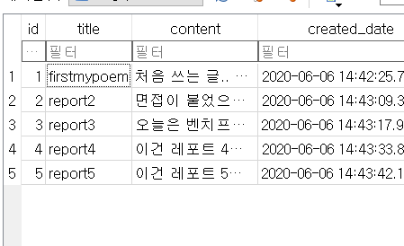

id값이 바로 기본키이다.

이를 이용해보자

```python
def post_detail(request, pk):
	post = Post.objects.get(pk=pk)
	context = {
		'post' : post
	}
	return render(request, 'blog/post_detail.html', context)
```

### 링크 동적으로 연결하기

이제 뷰는 모드 끝났고 링크만 연결하면 된다.

```html
<h3><a href="post/{{ post.pk }}">{{ post.title }}</a></h3>
```

이렇게 하면 post/id로 requset를 보내게 된다.

이로써 게시판을 만들었다.

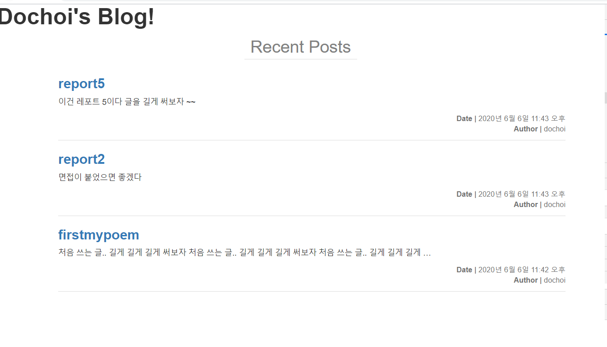

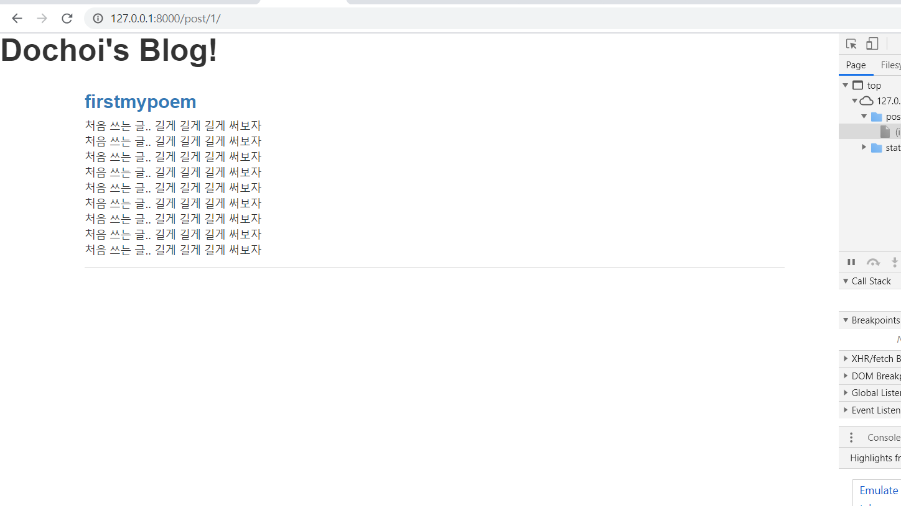

### 템플릿 상속

post_detail 과 post_list는 많은 부분에서 겹친다.

코드를 최적화해보자

```html

<!doctype html>
<html lang="en">
<head>
    <meta charset="UTF-8">
    <meta name="viewport"
          content="width=device-width, user-scalable=no, initial-scale=1.0, maximum-scale=1.0, minimum-scale=1.0">
    <meta http-equiv="X-UA-Compatible" content="ie=edge">
    <link rel="stylesheet" href="">
    <link rel="stylesheet" href="">
    <title>Post_list</title>
</head>
<body>
    <div class="header">
            <h1>Dochoi's Blog!</h1>
    </div>
    <div class="recent">Recent Posts</div>
    <div class="container">
        <ul class="list">
            
            <li class="item">
                <h3><a href="post/{{ post.pk }}">{{ post.title }}</a></h3>
                <div class="content">{{ post.content|truncatewords:20 }}</div>
                <div class="info">
                    <div class="published-date"><span>Date | </span>{{ post.published_date }}</div>
                    <div class="author"><span>Author | </span>{{ post.author }}</div>
                </div>

            </li>
            
        </ul>
    </div>
</body>
</html>
```

post_list


```html

<!doctype html>
<html lang="en">
<head>
    <meta charset="UTF-8">
    <meta name="viewport"
          content="width=device-width, user-scalable=no, initial-scale=1.0, maximum-scale=1.0, minimum-scale=1.0">
    <meta http-equiv="X-UA-Compatible" content="ie=edge">
    <link rel="stylesheet" href="">
    <link rel="stylesheet" href="">
    <title>Post_list</title>
</head>
<body>
    <div class="header">
            <h1>Dochoi's Blog!</h1>
    </div>
    <div class="container">
        <ul class="list">
            <li class="item">
                <h3><a href="">{{ post.title }}</a></h3>
                <div class="content">{{ post.content|linebreaksbr }}</div>
            </li>
        </ul>
    </div>
</body>
</html>
```

post_detail.html

코드가 유사하다.

템플릿을 상속하여 이를 합쳐보자

base.html이라는 부모 템플릿을 만들자

```python
# base.html


<!doctype html>
<html lang="en">
<head>
    <meta charset="UTF-8">
    <meta name="viewport"
          content="width=device-width, user-scalable=no, initial-scale=1.0, maximum-scale=1.0, minimum-scale=1.0">
    <meta http-equiv="X-UA-Compatible" content="ie=edge">
    <link rel="stylesheet" href="">
    <link rel="stylesheet" href="">
    <title>Post_list</title>
</head>
<body>
    <div class="header">
            <h1>Dochoi's Blog!</h1>
    </div>

</body>
</html>
```

그리고 두개의 겹치는 부분을 모두 지운다.

```html

    <div class="recent">Recent Posts</div>
    <div class="container">
        <ul class="list">
            
            <li class="item">
                <h3><a href="post/{{ post.pk }}">{{ post.title }}</a></h3>
                <div class="content">{{ post.content|truncatewords:20 }}</div>
                <div class="info">
                    <div class="published-date"><span>Date | </span>{{ post.published_date }}</div>
                    <div class="author"><span>Author | </span>{{ post.author }}</div>
                </div>

            </li>
            
        </ul>
    </div>

```

```html

    <div class="container">
        <ul class="list">
            <li class="item">
                <h3><a href="">{{ post.title }}</a></h3>
                <div class="content">{{ post.content|linebreaksbr }}</div>
            </li>
        </ul>
    </div>
```

이 둘은 자식템플릿이 된다.

그리고 base에

```
    
    
```

를추가해서 자식이 들어갈 공간을 만든다.

```html



    <div class="container">
        <ul class="list">
            <li class="item">
                <h3><a href="">{{ post.title }}</a></h3>
                <div class="content">{{ post.content|linebreaksbr }}</div>
            </li>
        </ul>
    </div>

```

```html



    <div class="recent">Recent Posts</div>
    <div class="container">
        <ul class="list">
            
            <li class="item">
                <h3><a href="post/{{ post.pk }}">{{ post.title }}</a></h3>
                <div class="content">{{ post.content|truncatewords:20 }}</div>
                <div class="info">
                    <div class="published-date"><span>Date | </span>{{ post.published_date }}</div>
                    <div class="author"><span>Author | </span>{{ post.author }}</div>
                </div>

            </li>
            
        </ul>
    </div>

```

extends는 상속을 명시한다.

```

```
<<<<<<< HEAD

## 기능 추가하기

post 게시하기

post 숨기기

post 추가하기

post 삭제하기를 만들어보자

### post 게시하기

앞에서 date가 없는 post를 표시하지 않게 설정했다 .

date를 부여하자

```python
from django.utils import timezone  # timezone 모듈을 불러온다.

def publish(self):
    self.published_date = timezone.now()  # published_date 에 현재시간을 할당
    self.save()  # 변경된 데이터베이스를 저장
```

```
posts = Post.objects.filter(published_date__isnull=True)
for post in posts:
    post.publish()
```

을 입력해준다 shell_plus에

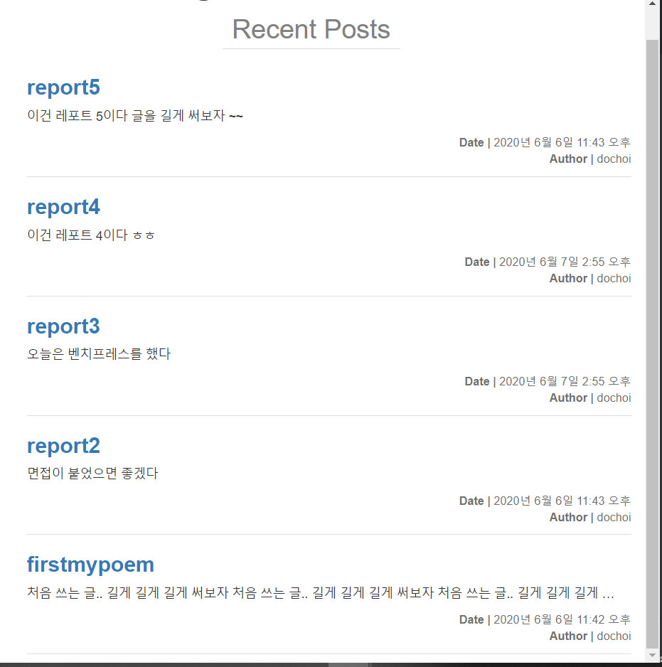

시간이 없던글이 시간이 만들어져서 생성되었다.

post 숨기기

post 객체의 published_date를 None으로 바꿔서 post를 숨겨보자

```python
def hide(self):
    self.published_date = None
    self.save()
```

이를 추가해준다

역시 쉘에서 이를 입력한다.

```
post = Post.objects.get(id=5)
post.hide()
```

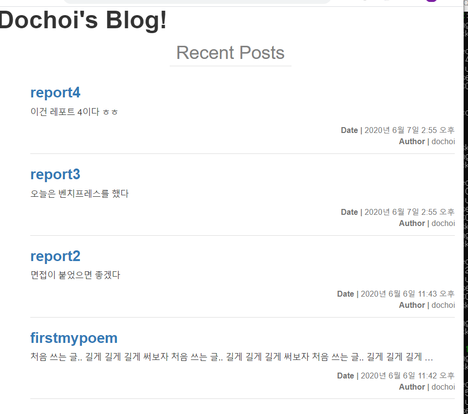

5번글이 숨겨졌다.(데이터는 존재한다.)

### Post 추가하기

관리자가 아닌 사용자가 글을 추가해보자

```python



<form action="" method="post">
    <h2 class="post-add">새 글 작성</h2>
    <div class="container">
        <div class="form-group">
            <label for="input-title">제목: </label>
            <input name="title" id="input-title" type="text" class="form-control" placeholder="글 제목">
        </div>
        <div class="form-group">
            <label for="input-content">내용: </label>
            <textarea name="content" id="input-content" class="form-control" rows="5" placeholder="글 내용"></textarea>
        </div>
        <button type="submit" class="btn btn-primary btn-lg">글 등록</button>
    </div>
</form>

```

post_add.html을 만든다.

#### 뷰와 URL 생성

```python
def post_add(request):
    return render(request, 'blog/post_add.html')
```

```python
from blog.views import post_list, post_detail, post_add


urlpatterns = [
    path('admin/', admin.site.urls),
    path('', post_list),
    path('post/<int:pk>/', post_detail),
    path('post/add/', post_add),
]

```

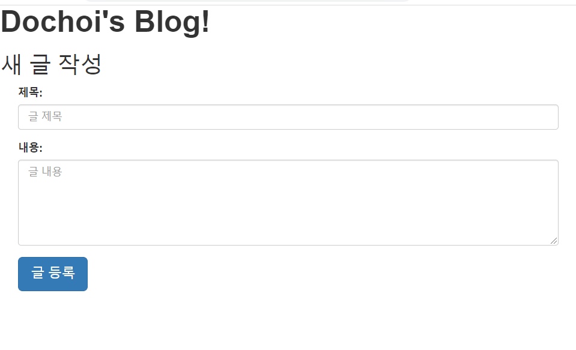

CSRF 검증에 실패한다

사용자가 자신의 의지와는 무관하게 특정 웹사이트를 수정할 수 없게 해놓았다.

폼에 위조 방지 토큰을 추가하자

```

```

이제 글을 입력하면 제목과 내용 데이터를 서버에 전송해서 데이터베이스에 저장하도록 구현하자

### form 태그 method

### GET

get은 폼에서 받은 데이터를 url주소에 질의문자 형태로 이여붙여서 데이터를 전달한다..

?뒷부분에 질의문자가 생긴다.

&는 질의문자에서 필드를 구분해준다.

url 주소에 데이터가 보이기 때문에 공개하면 안되는 데이터를 전송할 때는 get을 사용하지않는다.

### Post

post는 내부적으로 서버에 전달한다.

```python
def post_add(request):
    if request.method == 'POST':
        return HttpResponse('POST method')
    elif request.method == 'GET':
        return render(request, 'blog/post_add.html')
```

으로 수정하자

뷰가 받는 request는 객체처럼 다룰 수 있다

get 과 post는 http메소드이다

http://127.0.0.1:8000/post/add/?csrfmiddlewaretoken=6G1fGDZWng6TVjg6YvdnwtH1blBN2UTC1UUu0JQmCyxtd4w5nvoJ7DgV5bg1JZia&title=title&content=content

이런식의 주소를 확인할 수 있다.


```python

def post_add(request):
	if request.method == 'POST':
		User = get_user_model()
		author = User.objects.get(username='dochoi')
		title = request.POST['title']
		content = request.POST['content']
		post = Post.objects.create(
			title=title,
			author=author,
			content=content,
		)
		post.publish()
		return HttpResponse('POST method')
	elif request.method == 'GET':
		return render(request, 'blog/post_add.html')
```

수정해준다.

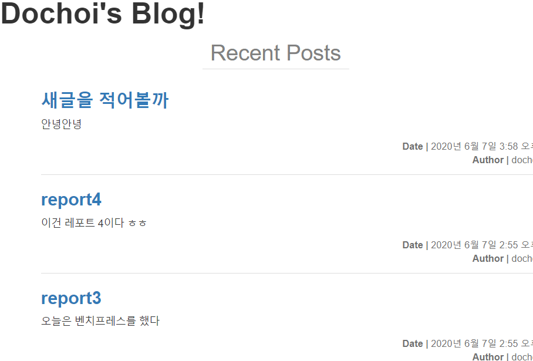

추가되는것을 볼 수 있다.

## redirect()

글을 등록하고 글에 페이지로 redirect하게하자

```python
post_pk = post.pk
        # 기본키를 전달한 post_detail 뷰를 redirect 함수에 전달.
        return redirect(post_detail, pk=post_pk)
```

뷰 오브작체를 넘겨주면 역참조 url 문제가 발생할 수 있다.

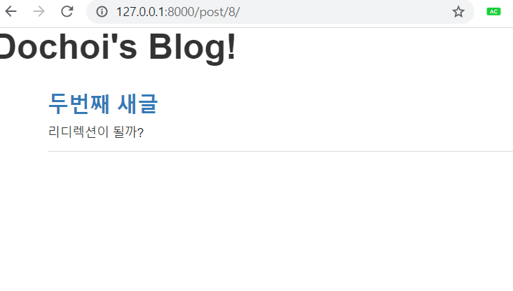

글을 작성하면 바로 글의 페이지로 넘어간다 !!

### post 추가 버튼 생성

html base 파일 수정

```python
<div class="header">
    # h1 태그를 a 태그로 감싸고 href 속성에 `/` 넣어주어 클릭하면 메인 화면으로 가도록 해준다. 
    <a class="home" href="/"><h1>Che1's Blog!</h1></a>
    # Add Post 버튼 추가
    <a class="add-post" href="">
        <button type="button" class="btn btn-info">Add Post</button>
    </a>
</div>
```

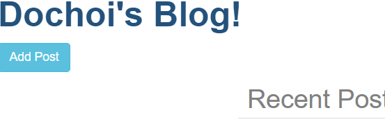

버튼이 생겼다 !!

이제 이버튼을 누르면 post/add로 가게 하자 !!

동적으로 

템플릿 테그를 이용해보자

```python
urlpatterns = [
    path('admin/', admin.site.urls),
    path('', post_list),
    path('post/<int:pk>/', post_detail),
    path('post/add/', post_add, name='post_add'),
]

```

이름을 부여하자

```python
# base.html

<div class="header">
    # h1 태그를 a 태그로 감싸고 href 속성에 `/` 넣어주어 클릭하면 메인 화면으로 가도록 해준다. 
    <a class="home" href="/"><h1>Che1's Blog!</h1></a>
    # Add Post 버튼 추가
    <a class="add-post" href="">
        <button type="button" class="btn btn-info">Add Post</button>
    </a>
</div>

```

버튼에 이를 넣어주자

## Post 삭제하기

### 글 삭제 버튼 추가

```html
# post_detail.html

<div class="container">
    <ul class="list">
        <li class="item">
            <h3><a href="">{{ post.title }}</a></h3>
            <div class="content">{{ post.content|linebreaksbr }}</div>
        </li>
    </ul>
    # 메인 화면으로 가는 버튼 추가
    <a href="/">
        <button type="button" class="btn btn-primary to-main">To Main</button>
    </a>
    # 글 삭제 버튼 추가
    <form action="" method="POST">
        
        <button type="submit" class="btn btn-danger">Delete Post</button>
    </form>
</div>
```

수정해주자

### delete 템플릿 생성

```html



<div class="container">
    <h1>글이 삭제되었습니다.</h1>
    <a href="/">
        <button type="button" class="btn btn-primary to-main">To Main</button>
    </a>
</div>

```

### delete URL 주소 설정

```python
urlpatterns = [
    path('admin/', admin.site.urls),
    path('', post_list),
    path('post/<int:pk>/', post_detail),
    path('post/add/', post_add, name='post_add'),
path('post/<int:pk>//delete/$', post_delete, name='post_delete'),

]
```

### delete 뷰 생성

```python
def post_delete(request, pk):
    if request.method == 'POST':
        post = Post.objects.get(pk=pk)
        post.delete()
        return render(request, 'blog/post_delete.html')

    elif request.method == 'GET':
        return HttpResponse('잘못된 접근 입니다.')
```

오로지 post요청으로만 삭제가 가능하다.

```html
<form action="" method="POST">
    
    <button type="submit" class="btn btn-danger">Delete Post</button>
</form>
```

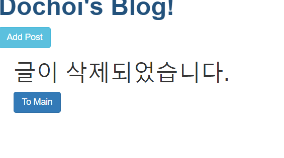

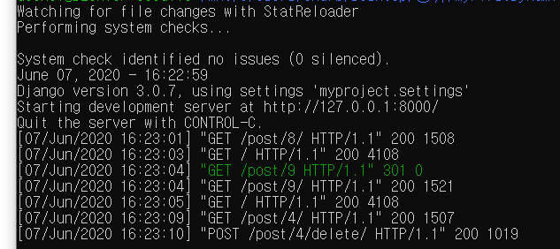

글이 삭제되었다.


## 마무리

이로써 게시판을 만들고, 글 생성 삭제 등 djang의 기초를 공부해보았다.

