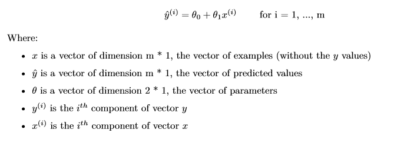
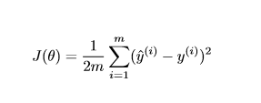
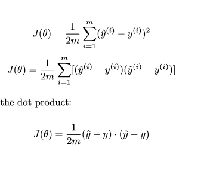
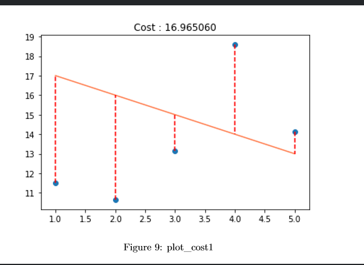

# Bootcamp Machine Learning day00

- 머신러닝 기초공부 day00에서 느낀점을 적는다.

- [Bootcamp Machine Learning day00](#bootcamp-machine-learning-day00)
  - [ex00](#ex00)
  - [ex01](#ex01)
    - [5차원 텐서 사이의 행렬 곱](#5차원-텐서-사이의-행렬-곱)
  - [ex02](#ex02)
  - [ex03](#ex03)
  - [ex04](#ex04)
  - [ex05](#ex05)
  - [ex06](#ex06)
  - [ex07](#ex07)
  - [ex08](#ex08)
  - [ex09](#ex09)
  - [ex 10](#ex-10)

## ex00

- **Vector class를 구현한다.**(Numpy 사용 금지)

`__add__` 와 `__sub__`를 구현할때 scalar인지 vector인지 구분하여 경우를 나누고

`__vector__`끼리 연산일땐 차원이 같은지 유의해서 구현한다.

`__div__`를 구현할땐 scalar값만 가능하다. 즉 벡터끼리 나누는것은 불가능하다.

`__mul__`을 구현할땐 Vector * Vector는 dot product로 scalar값이 나오고

​							scalar * Vector는 Vector가 나옴에 유의한다.

벡터끼리 연산시 차원이 같아야함에 유의한다.

- **`__str__`과 `__repr__`**:

  **공통점**은 둘다 문자열을 반환한다.

  `__str__`은 태생적인 목적이 인자를 '문자열화'해 반환한다.

  `repr`은 객체를 인간이 이해할 수있게 표현 한것이다.

`__str__`가 서로 다른 자료형 간에 인터페이스를 제공하기 위해서 존재한다면, `repr`은 해당 객체를 인간이 이해할 수 있는 표현으로 나타내기 위한 용도이다.**


## ex01

- **Matrix class를 구현한다.**(Numpy 사용 금지)

Vector class와 유사하지만

`__mul__`연산시 유의한다.

2차원 곱이 되는지 확인한다. > (m x n) * (n x k) = (m x k)

아래는 그이상에서 행렬 곱이 가능한지를 확인할 때 참고하자

### 5차원 텐서 사이의 행렬 곱

그러면 아래와 같이 5차원 텐서 사이의 행렬 곱(tf.matmul)도 작동할까요?

```
A = tf.Variable(tf.random_normal([5, 4, 10, 2, 3]))
B = tf.Variable(tf.random_normal([5, 4, 10, 3, 7]))
C = tf.matmul(A, B)
```

가능합니다! 위 코드를 아래와 같이 실행해보면 오류 없이 잘 실행되고 C의 차원으로 5x4x10x2x7을 얻었습니다.

이를 통해 3차원 이상의 텐서 사이의 행렬 곱은 행렬의 차원을 나타내는 마지막 두 개의 차원(2x3, 3x7) 사이에 행렬 곱이 가능하고 행렬 앞에 있는 차원(5x4x10)이 같으면 가능한 것을 알 수 있습니다.


## ex02

간단한 통계공부이다.

평균(mean), 중간값(median), 사분위수(quartiles), 분산(variance ),  표준편차(standard deviation)

이다.


##  ex03

간단한 예측을 만든다




x가 입력으로 주어졌을때 theta를 적용하여 y_hat를 리턴한다.


## ex04

ex03에서 x배열에 1 값의원소를 추가한다 ( theta_0을 dot_product에 적용시키기 위함)


## ex05

ex04에서 만든 배열로 행렬곱을 해  theta_0을 y_hat의 에 적용되게 해준다.


## ex06

matplot을 이용해  그래프를 그린다.

y값을 특정해 둔후 theta에 따른 y_hat과 얼마나 유사한지 판별할 수 있다.


## ex07

평가함수를 만든다.

MSE /2인데 2로 나누는 이유가 있다고 한다.



## ex08



이 공식을 이용하여 @연산으로 평가 cost를 반환한다.


## ex09



평가점수를 시각화한다.

## ex 10

선형대수에서 행렬의 교환법칙이 성립하는가?

왜 배열에 값이 1인 열을 추가하는가?

등의 간단한 질문이 이어진다.