# Bootcamp Machine Learning day04

- 머신러닝 기초공부 day04에서 느낀점을 적는다.

  전체주제는 **Regularization** 이다.


## ex00

**Logistic Regression**

day03에서 구현한 Logistic Regression 클래스이다.

```python
# **************************************************************************** #
#                                                                              #
#                                                         :::      ::::::::    #
#    my_logistic_regression.py                          :+:      :+:    :+:    #
#                                                     +:+ +:+         +:+      #
#    By: dochoi <dochoi@student.42seoul.kr>         +#+  +:+       +#+         #
#                                                 +#+#+#+#+#+   +#+            #
#    Created: 2020/05/30 02:00:53 by dochoi            #+#    #+#              #
#    Updated: 2020/05/30 17:27:02 by dochoi           ###   ########.fr        #
#                                                                              #
# **************************************************************************** #

import numpy as np
import math

class MyLogisticRegression(object):
    """ Description: My personnal logistic regression to classify things. """

    def __init__(self, thetas, alpha=0.003, n_cycle=30000):
        self.alpha = alpha
        self.n_cycle = n_cycle
        self.thetas = np.array(thetas, dtype=float).reshape(-1, 1)

    def add_intercept(self,x):
        if len(x) == 0 or x.ndim >= 3:
            return None
        if x.ndim == 1:
            return np.vstack((np.ones(len(x)), x)).T
        else:
            return np.insert(x, 0, 1, axis=1)

    def log_gradient(self, x, y):
        if len(x) == 0 or len(y) == 0 or len(self.thetas) == 0:
            return None
        return np.sum(self.add_intercept(x).T @ (self.predict_(x) - y) / len(x),axis=1).reshape(-1,1)

    def fit_(self, x, y):
        if len(x) == 0 or len(y) == 0 or len(self.thetas) == 0:
            return None
        n_cycle= self.n_cycle
        while n_cycle:
            self.thetas -= self.alpha * ((self.log_gradient(x, y)))
            n_cycle -= 1
        return self.thetas

    def predict_(self,x):
        if (len(x) == 0 or len(self.thetas) == 0 or x.shape[1] != (len(self.thetas) - 1)):
            return None
        return 1 / (1 + pow(math.e, -self.add_intercept(x) @ self.thetas))

    def cost_(self, x, y, eps=1e-15):
        y_hat = self.predict_(x) - eps
        if (y.shape != y_hat.shape or len(y) == 0 or len(y_hat) == 0):

            return None
        return -sum((y * np.log(y_hat)) + ((1 - y) * np.log(1 - y_hat)) ).squeeze() / len(y_hat)

```


## ex01

day02에서 구현한 add_polynomial_features 함수이다.


```python
# **************************************************************************** #
#                                                                              #
#                                                         :::      ::::::::    #
#    polynomial_model.py                                :+:      :+:    :+:    #
#                                                     +:+ +:+         +:+      #
#    By: dochoi <dochoi@student.42seoul.kr>         +#+  +:+       +#+         #
#                                                 +#+#+#+#+#+   +#+            #
#    Created: 2020/05/27 16:40:41 by dochoi            #+#    #+#              #
#    Updated: 2020/05/30 22:38:30 by dochoi           ###   ########.fr        #
#                                                                              #
# **************************************************************************** #

import numpy as np

def add_polynomial_features(x, power):
    temp = x.copy()
    for i in range(2, power + 1):
        temp = np.append(temp, np.power(x, i), axis=1 )
    return temp

```


## ex02

### Question Time!

day02에서 물어봤던 질문들이다.

**1 - What is overfitting?**

- 모집단이 아닌 train데이터에만 cost함수가 최적으로 맞춰진것이다. 이 경우 실제 새로운 데이터값이 들어오면 오차가 커질 수 있다.

**2 - What do you think underfitting might be?**

- **overfitting**이 다항식이 복잡해져서 일어났다면 **underfitting**은 다항식이 너무 단순하여 오차가 줄어들지 않는 경우를 말할 것 같습니다.


**3 - Why is it important to split the data set in a training and a test set?**

- 새로운 데이터를 테스트 해 봐서 **overfitting**을 막기 위함입니다.


**4 - If a model overfits, what will happen when you compare its performance on the training set and the test set?**

- training set에서는 최고의 효율로 예측하겠지만 test set에서는 오차가 많이 발생합니다.

**5 - If a model underfits, what do you think will happen when you compare its performance on the training set and the test set?**

- underfitting이 일어난다면 test set과 training set 모두 오차가 많이 발생할 것 같습니다.


## ex03

### Polynomial models 2

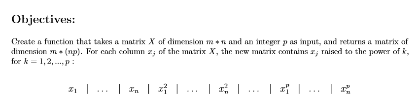

내가 구현한 Polynomial models는 이미 이 조건을 만족했다 ..
따라서 그대로 쓰겠다.

```python
def add_polynomial_features(x, power):
    """Add polynomial features to matrix x by raising its columns to every power in the range of
    ,! 1 up to the power given in argument.
    Args:
    x: has to be an numpy.ndarray, a matrix of dimension m * n.
    power: has to be an int, the power up to which the columns of matrix x are going to be
    ,! raised.
    Returns:
    The matrix of polynomial features as a numpy.ndarray, of dimension m * (np), containg the
    ,! polynomial feature values for all training examples.
    None if x is an empty numpy.ndarray.
    Raises:
    This function should not raise any Exception.
    """
    temp = x.copy()
    for i in range(2, power + 1):
        temp = np.append(temp, np.power(x, i), axis=1 )
    return temp
```

## Interlude - Fighting Overfitting... With Regularization

Evaluate 단계 ..

day02에서 데이터를 train과 test로 나누는 이유와 overfitting에 대해 공부하였다.
하지만 overfitting을 detect할 수 있다고 overfitting을 피할 순 없다. 이 문제를 해결하기 위해, 우리는 **Regularization**을 사용한다. overfitting은 model이 training data와 관련 없는 신호를 활용하기 때문에 발생한다.  기본적인 아이디어는 모델에게 특정(보통 무거운 다항식) features에 너무 많은 비중을 두는것에 대해 불이익을 주는것이다. cost함수에 extra term을 추가하자

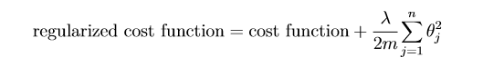

이렇게 함으로써 θ 값을 가능한 작게 유지하게 할 수 있다.

λ(람다)는 reglarization 이 모델에 영향을 미치는것을 수정할 수 있는 매개변수이다.

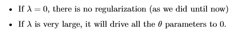

**Notice**

in the regularization term, the sum starts at j =1 because we do NOT want to penalize the value of θ0 (the y-intercept, which doesn’t depend on a feature).

θ0에는 영향을 주지 않기 위해 j=1로 시작한다.

**Be carefull!**

Machine Learning was essentially developed by computer scientists (not mathematicians). This can cause problems when we try to represent things mathematically. For example: using the θ0 notation to represent the y-intercept makes things easy when we apply the linear algebra trick, but it completly messes up the overall matrix notation!

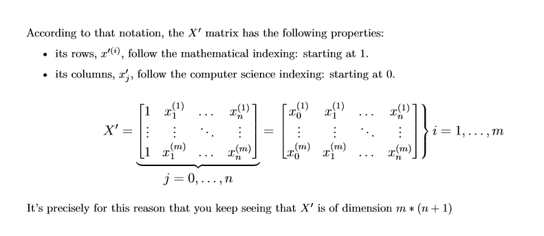

지금까지 해왔던 이야기를 한다. theta0을 적용하기 때문에 X`의 차원이 m *(n + 1)이며

행은 인덱스가 1로 시작하고 컬럼은 인덱스가 0으로 시작한다.

### Terminology

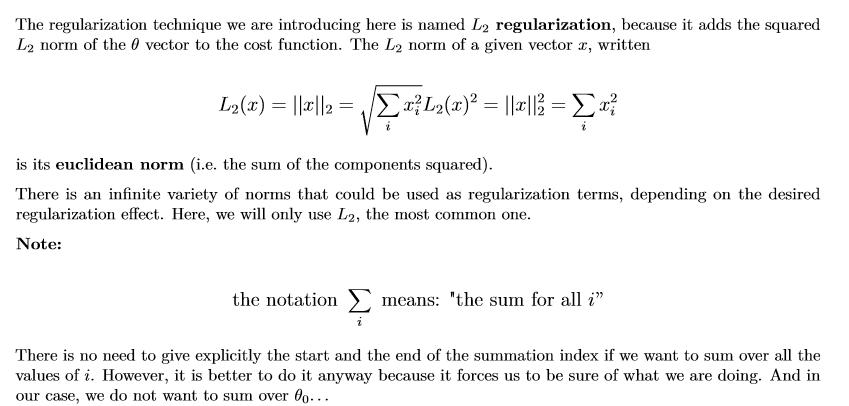

여기서 norm에 대한 이야기가 나온다. 선형대수학때 배운 norm이다 단순히 크기라고 정의하기엔 꽤나 복잡한 친구다.. euclidean norm 은 거리, 크기 개념으로 절댓값 제곱의 합의 제곱근으로 구해진다.

다시,  regularization 기술은 **L2 regularization**을 사용 한다고 한다.

이유는 theta vector L2 norm의 제곱을 cost 함수에 더해주기 때문이다.

L2 함수는  euclidean norm 이다.

여기서 regularization terms에 사용할 수 있는 norms의 종류는 굉장히 많다.(L2가 아니더라도)

우리는 가장 대중적인 L2를 사용한다.

저 시그마에서 우리는 theta0은 합치지 않을 것이다.

vectorization을 이용해서 위 계산을 효율적으로 할 수 있다.

## Interlude - Answers to the Vectorization Problem

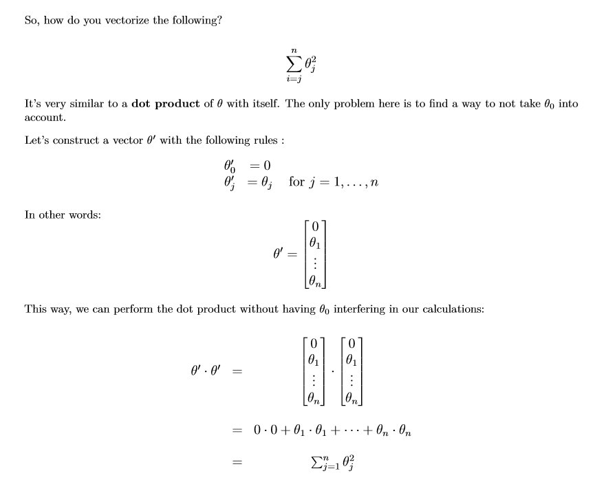

theta0은 간섭하지 않을것이기 때문에 0으로 두고 dot product를 하면 위 식을 얻을 수 있다.


## ex04

L2 Regularization

이 함수를 반복문 버전과 vectorized 버전으로 구하자


```python
# **************************************************************************** #
#                                                                              #
#                                                         :::      ::::::::    #
#    l2_reg.py                                          :+:      :+:    :+:    #
#                                                     +:+ +:+         +:+      #
#    By: dochoi <dochoi@student.42seoul.kr>         +#+  +:+       +#+         #
#                                                 +#+#+#+#+#+   +#+            #
#    Created: 2020/05/31 02:37:01 by dochoi            #+#    #+#              #
#    Updated: 2020/05/31 02:46:58 by dochoi           ###   ########.fr        #
#                                                                              #
# **************************************************************************** #

import numpy as np

def iterative_l2(theta):
    """Computes the L2 regularization of a non-empty numpy.ndarray, with a for-loop.
    Args:
    theta: has to be a numpy.ndarray, a vector of dimension n * 1.
    Returns:
    The L2 regularization as a float.
    None if theta in an empty numpy.ndarray.
    Raises:
    This function should not raise any Exception.
    """
    if len(theta) == 0:
        return None
    l2_lst = [i * i for i in theta]
    return sum(l2_lst) - l2_lst[0]


def l2(theta):
    """Computes the L2 regularization of a non-empty numpy.ndarray, without any for-loop.
    Args:
    theta: has to be a numpy.ndarray, a vector of dimension n * 1.
    Returns:
    The L2 regularization as a float.
    None if theta in an empty numpy.ndarray.
    Raises:
    This function
    """
    if len(theta) == 0:
        return None
    l2_lst = theta * theta
    return np.sum(l2_lst) - l2_lst[0]
```

## ex05

###  Regularized Linear Cost Function

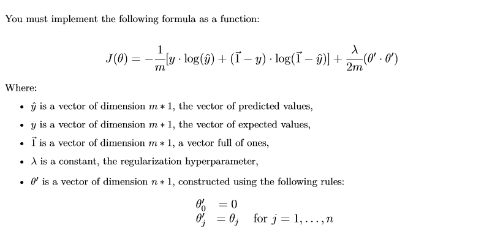

저 cost함수를 구현하자 이미 전에 linear cost function은구현했기 때문에 뒤에 Regularization term만 붙여주면 될거 같다. 

```python
# **************************************************************************** #
#                                                                              #
#                                                         :::      ::::::::    #
#    linear_cost_reg.py                               :+:      :+:    :+:    #
#                                                     +:+ +:+         +:+      #
#    By: dochoi <dochoi@student.42seoul.kr>         +#+  +:+       +#+         #
#                                                 +#+#+#+#+#+   +#+            #
#    Created: 2020/05/31 02:48:04 by dochoi            #+#    #+#              #
#    Updated: 2020/05/31 03:12:11 by dochoi           ###   ########.fr        #
#                                                                              #
# **************************************************************************** #

import numpy as np
import math

def cost_(y, y_hat):
    if len(y) == 0 or len(y_hat) == 0 or y.shape != y_hat.shape:
        return None
    return ((y_hat - y) @ (y_hat - y)) / (2 * len(y))

def l2(theta):
    if len(theta) == 0:
        return None
    l2_lst = theta * theta
    return np.sum(l2_lst) - l2_lst[0]

def reg_cost_(y, y_hat, theta, lambda_):
    """Computes the regularized cost of a linear regression model from two non-empty
    ,! numpy.ndarray, without any for loop. The two arrays must have the same dimensions.
    Args:
    y: has to be an numpy.ndarray, a vector of dimension m * 1.
    y_hat: has to be an numpy.ndarray, a vector of dimension m * 1.
    theta: has to be a numpy.ndarray, a vector of dimension n * 1.
    lambda_: has to be a float.
    Returns:
    The regularized cost as a float.
    None if y, y_hat, or theta are empty numpy.ndarray.
    None if y and y_hat do not share the same dimensions.
    Raises:
    This function should not raise any Exception.
    """
    if (len(y) == 0 or len(y_hat) == 0 or len(theta) == 0):
        return None
    if (y.shape != y_hat.shape):
        return None
    return cost_(y, y_hat)  + (lambda_ * l2(theta)/(2 * len(y_hat)))
```

데코레이터를 사용하면 깔끔할거 같지만 가독성이 떨어진다. 또한 아직 내가 데코레이터에 대한 이해가 부족하다.

## ex06

### Regularized Logistic Cost Function


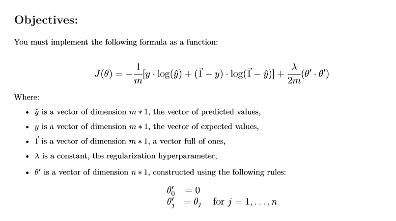

마찬가지이다. 이전에 Logistic Cost Function도 구현했기 때문에 뒤에 regulariztion term만 붙여준다.

```python
# **************************************************************************** #
#                                                                              #
#                                                         :::      ::::::::    #
#    logistic_cost_reg.py                               :+:      :+:    :+:    #
#                                                     +:+ +:+         +:+      #
#    By: dochoi <dochoi@student.42seoul.kr>         +#+  +:+       +#+         #
#                                                 +#+#+#+#+#+   +#+            #
#    Created: 2020/05/31 03:17:13 by dochoi            #+#    #+#              #
#    Updated: 2020/05/31 03:19:25 by dochoi           ###   ########.fr        #
#                                                                              #
# **************************************************************************** #

import numpy as np

def vec_log_loss_(y, y_hat, eps=1e-15):
    if (y.shape != y_hat.shape or len(y) == 0 or len(y_hat) == 0):
        return None
    y_hat = y_hat - eps
    return -sum((y * np.log(y_hat)) + ((1 - y) * np.log(1 - y_hat)) ) / len(y_hat)

def l2(theta):
    if len(theta) == 0:
        return None
    l2_lst = theta * theta
    return np.sum(l2_lst) - l2_lst[0]

def reg_log_cost_(y, y_hat, theta, lambda_):
    """Computes the regularized cost of a logistic regression model from two non-empty
    ,! numpy.ndarray, without any for loop. The two arrays must have the same dimensions.
    Args:
    y: has to be an numpy.ndarray, a vector of dimension m * 1.
    y_hat: has to be an numpy.ndarray, a vector of dimension m * 1.
    theta: has to be a numpy.ndarray, a vector of dimension n * 1.
    lambda_: has to be a float.
    Returns:
    The regularized cost as a float.
    None if y, y_hat, or theta is empty numpy.ndarray.
    None if y and y_hat do not share the same dimensions.
    Raises:
    This function should not raise any Exception.
    """
    if (len(y) == 0 or len(y_hat) == 0 or len(theta) == 0):
        return None
    if (y.shape != y_hat.shape):
        return None
    return vec_log_loss_(y, y_hat)  + (lambda_ * l2(theta)/(2 * len(y_hat)))
```


## Interlude - Regularized Gradient

### Imporve

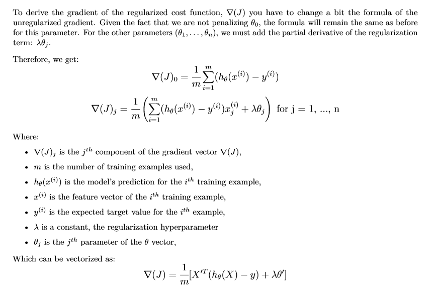

cost함수에 Regulariztion term을 추가 했기 때문에 이를 미분한 Gradient에도 이 텀을 미분한 식이 추가된다.

### Linear Gradient vs Logitic Gradient 

이 둘은 hypothesis function이 유일하게 다르다.

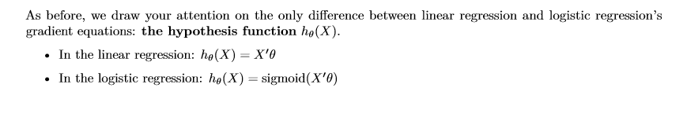

## ex07

### Regularized Linear Gradient

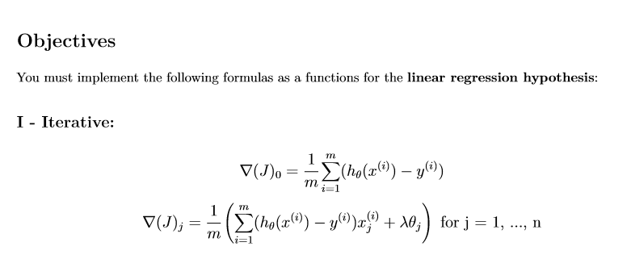


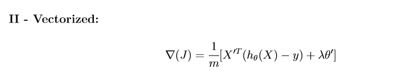

 formulas as a functions for the linear regression hypothesis을

iterative , Vectorized 두가지 버전으로 구현해본다.

```python
# **************************************************************************** #
#                                                                              #
#                                                         :::      ::::::::    #
#    reg_linear_grad.py                                 :+:      :+:    :+:    #
#                                                     +:+ +:+         +:+      #
#    By: dochoi <dochoi@student.42seoul.kr>         +#+  +:+       +#+         #
#                                                 +#+#+#+#+#+   +#+            #
#    Created: 2020/05/31 13:37:39 by dochoi            #+#    #+#              #
#    Updated: 2020/05/31 13:58:34 by dochoi           ###   ########.fr        #
#                                                                              #
# **************************************************************************** #

import numpy as np

def add_intercept(x):
    if len(x) == 0 or x.ndim >= 3:
        return None
    if x.ndim == 1:
        return np.vstack((np.ones(len(x)), x)).T
    else:
        return np.insert(x, 0, 1, axis=1)

def predict_(x, theta):
    if x.ndim == 1:
        x = x[:,np.newaxis]
    if len(theta) - 1 != x.shape[1]  or len(x) == 0:
        return None
    return add_intercept(x) @ theta

def reg_linear_grad(y, x, theta, lambda_):
    """Computes the regularized linear gradient of three non-empty numpy.ndarray, with two
    for-loop. The three arrays must have compatible dimensions.
    Args:
    y: has to be a numpy.ndarray, a vector of dimension m * 1.
    x: has to be a numpy.ndarray, a matrix of dimesion m * n.
    theta: has to be a numpy.ndarray, a vector of dimension n * 1.
    lambda_: has to be a float.
    Returns:
    A numpy.ndarray, a vector of dimension n * 1, containing the results of the formula for all
    ,! j.
    None if y, x, or theta are empty numpy.ndarray.
    None if y, x or theta does not share compatibles dimensions.
    Raises:
    This function should not raise any Exception.
    """
    if len(y) == 0 or len(x) == 0 or len(theta) == 0:
        return None
    if len(y) != len(x) or len(x[0]) != len(theta) - 1:
        return None
    y_hat = predict_(x, theta)
    answer = np.sum(y_hat- y)
    for j in range(0, len(theta) - 1):
        temp = 0.0
        for i in range(len(x)):
            temp += ((y_hat[i] - y[i]) * x[i][j])
        answer = np.append(answer, temp + lambda_ * theta[j + 1])
    return (answer / len(x)).reshape(-1,1)

def vec_reg_linear_grad(y, x, theta, lambda_):
    """Computes the regularized linear gradient of three non-empty numpy.ndarray, without any
    for-loop. The three arrays must have compatible dimensions.
    Args:
    y: has to be a numpy.ndarray, a vector of dimension m * 1.
    x: has to be a numpy.ndarray, a matrix of dimesion m * n.
    theta: has to be a numpy.ndarray, a vector of dimension n * 1.
    lambda_: has to be a float.
    Returns:
    A numpy.ndarray, a vector of dimension n * 1, containing the results of the formula for all j.
    None if y, x, or theta are empty numpy.ndarray.
    None if y, x or theta does not share compatibles dimensions.
    Raises:
    This function should not raise any Exception.
    """
    if len(y) == 0 or len(x) == 0 or len(theta) == 0:
        return None
    if len(y) != len(x) or len(x[0]) != len(theta) - 1:
        return None
    answer = add_intercept(x).T @ (predict_(x, theta) - y) + (lambda_ * theta)
    answer[0] -= lambda_ * theta[0]
    return answer / len(x)
```

vectorize 버전에선 theta0의 간섭을 피하기 위해 마지막에 다시 값을 빼줬다.


## ex08

### Regularized Logistic Gradient

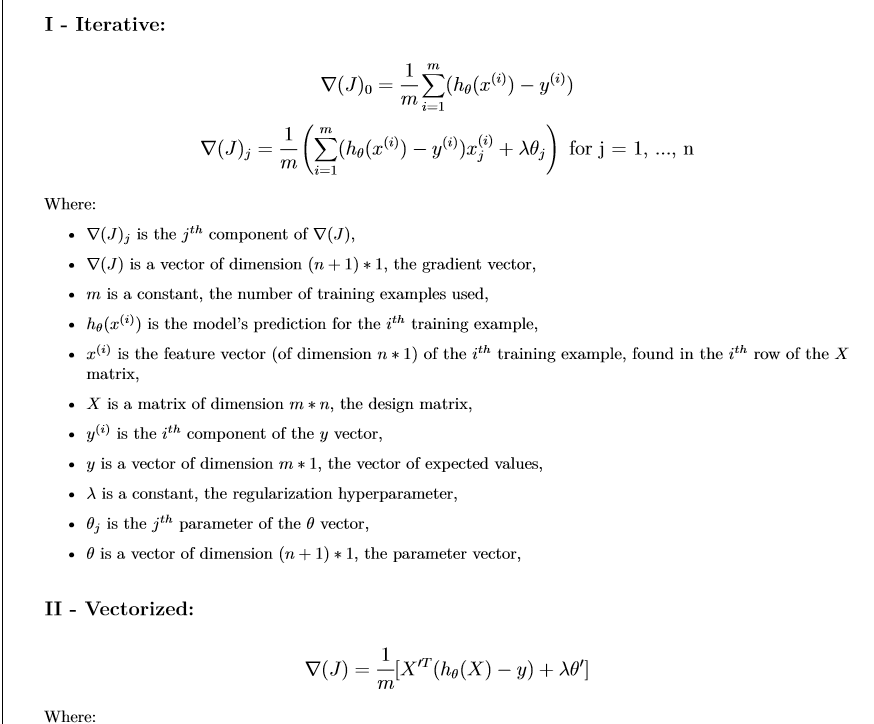

ex07과 동일한식에서 hypothesis만 수정하면 된다.


## Interlude - Linear Regression to the Next Level: Ridge Regression

Linear Regression에 L2 Regularization을 적용하면 Ridge Regression model이라고 한다.

이는 L2로 Regulariztion을한 Linear Regression과 다를 바 없다.

## ex09

Ridge Regression을 상속을 통해 만들자

```python
# **************************************************************************** #
#                                                                              #
#                                                         :::      ::::::::    #
#    ridge.py                                           :+:      :+:    :+:    #
#                                                     +:+ +:+         +:+      #
#    By: dochoi <dochoi@student.42seoul.kr>         +#+  +:+       +#+         #
#                                                 +#+#+#+#+#+   +#+            #
#    Created: 2020/05/31 16:02:01 by dochoi            #+#    #+#              #
#    Updated: 2020/05/31 16:19:15 by dochoi           ###   ########.fr        #
#                                                                              #
# **************************************************************************** #

import numpy as np
import pandas as pd
from matplotlib import pyplot as plt
import math

class MyLinearRegression(object):
    """ Description: My personnal linear regression class to fit like a boss. """
    def __init__(self, thetas, alpha=0.000001, n_cycle=30000):
        self.alpha = alpha
        self.n_cycle = n_cycle
        self.thetas = np.array(thetas, dtype=float).reshape(-1, 1)

    def add_intercept(self,x):
        if len(x) == 0 or x.ndim >= 3:
            return None
        if x.ndim == 1:
            return np.vstack((np.ones(len(x)), x)).T
        else:
            return np.insert(x, 0, 1, axis=1)

    def gradient(self, x, y):
        if len(x) == 0 or len(y) == 0 or len(self.thetas) == 0:
            return None
        return self.add_intercept(x).T @ (self.predict_(x).reshape(-1,1) - y) / len(x)

    def fit_(self, x, y):
        if len(x) == 0 or len(y) == 0 or len(self.thetas) == 0:
            return None
        n_cycle= self.n_cycle
        while n_cycle:
            self.thetas -= self.alpha * ((self.gradient(x, y)))
            # for i, v in enumerate(self.gradient(x, y)):
            #     self.thetas[i] -= (self.alpha * v)
            n_cycle -= 1
        return self.thetas

    def predict_(self,x):
        if x.ndim == 1:
            x = x[:,np.newaxis]
        if len(self.thetas) - 1 != x.shape[1]  or len(x) == 0:
            return None
        return self.add_intercept(x) @ self.thetas

    def cost_elem_(self, x, y):
        y_hat = self.predict_(x)
        if y.ndim == 1:
            y = y[:,np.newaxis]
        if y.shape != y_hat.shape or len(y) == 0 or len(y_hat) ==0:
            return None
        return ((y - y_hat) ** 2) / (2 * len(y))

    def cost_(self, x, y):
        y_hat = self.predict_(x)
        if len(y) == 0 or len(y_hat) == 0 or y.shape != y_hat.shape:
            return None
        return (sum((y_hat - y) * (y_hat - y)).squeeze() / (2 * len(y)))

class MyRidge(MyLinearRegression):
    """
    Description:
    My personnal ridge regression class to fit like a boss.
    """
    def __init__(self, thetas, alpha=0.001, n_cycle=1000, lambda_=0.5):
        self.alpha = alpha
        self.max_iter = max_iter
        self.thetas = thetas
        self.lambda_ = lambda_
    def gradient(self, x, y):

        if len(y) == 0 or len(x) == 0 or len(self.thetas) == 0:
            return None
        if len(y) != len(x) or len(x[0]) != len(self.thetas) - 1:
            return None
        answer = add_intercept(x).T @ (predict_(x, self.thetas) - y) + (self.lambda_  * self.thetas)
        answer[0] -= self.lambda_  * self.thetas[0]
        return answer / len(x)
    def cost_(y, y_hat):
        if len(y) == 0 or len(y_hat) == 0 or y.shape != y_hat.shape:
            return None
        return ((y_hat - y) @ (y_hat - y)) / (2 * len(y))

    def l2(theta):
        if len(theta) == 0:
            return None
        l2_lst = theta * theta
        return np.sum(l2_lst) - l2_lst[0]

    def reg_cost_(y, y_hat, theta, lambda_):
        if (len(y) == 0 or len(y_hat) == 0 or len(theta) == 0):
            return None
        if (y.shape != y_hat.shape):
            return None
        return cost_(y, y_hat)  + (lambda_ * l2(theta)/(2 * len(y_hat)))
```


## ex10

Ridge Regression을 polynomial model에서 적용해보자

1. 데이터를 학습과 테스트 셋으로 나누고
2. 모델을 10개를 한다 1개는(Linear Regression) 나머지 9개는는(Ridge Regression)

polynomial hypothesis는 degree 3으로 하고 The Ridge Regression model은 람다값을 0.1에서 1로 바꿔가면서 만든다.

3. MSE를 이용하여 평가한다.
4. MSE score을 각각의 람다값을 적용한 모델마다 bar plot한다.
5. original data points 위에 hypothisis를 그래프를 표시한다. 


**여기서 polynomial model 에 변수도 다변수이다. theta를 그만큼 늘려야한다.  ** degree가 3이고 features도 3개이니 theta는 10개여야한다.

```python
# **************************************************************************** #
#                                                                              #
#                                                         :::      ::::::::    #
#    polynomial_ridge.py                                :+:      :+:    :+:    #
#                                                     +:+ +:+         +:+      #
#    By: dochoi <dochoi@student.42seoul.kr>         +#+  +:+       +#+         #
#                                                 +#+#+#+#+#+   +#+            #
#    Created: 2020/05/31 16:24:37 by dochoi            #+#    #+#              #
#    Updated: 2020/05/31 18:40:47 by dochoi           ###   ########.fr        #
#                                                                              #
# **************************************************************************** #


import numpy as np
import pandas as pd
from matplotlib import pyplot as plt
import math
from data_spliter import data_spliter
from polynomial_model_extended import add_polynomial_features

def zscore(x):
    if len(x) == 0:
        return none
    mu = sum(x)/len(x)
    temp = 0.0
    for elem in x:
        temp += ((elem - mu) * (elem - mu))
    var = temp
    std = np.sqrt(var/ (len(x) - 1))
    return (x - mu) / std

class MyLinearRegression(object):
    """ Description: My personnal linear regression class to fit like a boss. """
    def __init__(self, thetas, alpha=0.01, n_cycle=300000):
        self.alpha = alpha
        self.n_cycle = n_cycle
        self.thetas = np.array(thetas, dtype=float).reshape(-1, 1)

    def add_intercept(self,x):
        if len(x) == 0 or x.ndim >= 3:
            return None
        if x.ndim == 1:
            return np.vstack((np.ones(len(x)), x)).T
        else:
            return np.insert(x, 0, 1, axis=1)

    def gradient(self, x, y):
        if len(x) == 0 or len(y) == 0 or len(self.thetas) == 0:
            return None
        return self.add_intercept(x).T @ (self.predict_(x).reshape(-1,1) - y) / len(x)

    def fit_(self, x, y):
        if len(x) == 0 or len(y) == 0 or len(self.thetas) == 0:
            return None
        n_cycle= self.n_cycle
        while n_cycle:
            self.thetas -= self.alpha * ((self.gradient(x, y)))
            n_cycle -= 1
        return self.thetas

    def predict_(self,x):
        if x.ndim == 1:
            x = x[:,np.newaxis]
        if len(self.thetas) - 1 != x.shape[1]  or len(x) == 0:
            return None
        return self.add_intercept(x) @ self.thetas

    def cost_elem_(self, x, y):
        y_hat = self.predict_(x)
        if y.ndim == 1:
            y = y[:,np.newaxis]
        if y.shape != y_hat.shape or len(y) == 0 or len(y_hat) ==0:
            return None
        return ((y - y_hat) ** 2) / (2 * len(y))

    def cost_(self, x, y):
        y_hat = self.predict_(x)
        if len(y) == 0 or len(y_hat) == 0 or y.shape != y_hat.shape:
            return None
        return (sum((y_hat - y) * (y_hat - y)).squeeze() / (2 * len(y)))

class MyRidge(MyLinearRegression):
    """
    Description:
    My personnal ridge regression class to fit like a boss.
    """
    def __init__(self, thetas, alpha=0.001, n_cycle=30000, lambda_=0.5):
        self.alpha = alpha
        self.n_cycle = n_cycle
        self.thetas = thetas
        self.lambda_ = lambda_
    def gradient(self, x, y):
        if len(y) == 0 or len(x) == 0 or len(self.thetas) == 0:
            return None
        if len(y) != len(x) or len(x[0]) != len(self.thetas) - 1:
            print(self.thetas)
            return None
        answer = self.add_intercept(x).T @ (self.predict_(x) - y) + (self.lambda_  * self.thetas)
        answer[0] -= self.lambda_  * self.thetas[0]
        return answer / len(x)

    def l2(self, theta):
        if len(theta) == 0:
            return None
        l2_lst = theta * theta
        return np.sum(l2_lst) - l2_lst[0]

    def reg_cost_(self, x, y):
        if (len(y) == 0 or len(x) == 0 or len(self.thetas) == 0):
            return None
        if (len(y) != len(x)):
            return None
        return self.cost_(x, y)  + (self.lambda_ * self.l2(self.thetas)/(2 * len(y)))
# Your code here
#... other methods ...


csv_data = pd.read_csv("../resources/spacecraft_data.csv")

x = np.array(csv_data[['Age','Thrust_power','Terameters']])

y = np.array(csv_data["Sell_price"]).reshape(-1,1)
y_n = []
x = zscore(x)
y = zscore(y)
temp = data_spliter(x, y, 0.5)
x_train = temp[0]
x_test = temp[1]

y_train = temp[2]
y_test = temp[3]

x_test_add_poly = add_polynomial_features(x_test, 3)
x_train_add_poly = add_polynomial_features(x_train, 3)
theta = np.array([[0],
    [0],
    [ 0],
    [0],[ 0],[ 0],[ 0],[ 0],[ 0],[ 0]], dtype=float)
mylr0 = MyRidge(theta, lambda_=0)
mylr0.fit_(x_train_add_poly, y_train)
mylr0.alpha = 0.003
mylr0.fit_(x_train_add_poly, y_train)
mylr0.alpha = 0.01
mylr0.fit_(x_train_add_poly, y_train)
mylr0.alpha = 0.03
mylr0.fit_(x_train_add_poly, y_train)

i = 0
plt.title(str(i))
plt.scatter(x_test[:,0], y_test,color="black", s=12, alpha=0.7,marker='s')
plt.scatter(x_test[:,0], mylr0.predict_(x_test_add_poly),color="red", s=7,alpha=0.7)
plt.legend(['Sell_price', 'Predicted sell_price'])
plt.show()
y_n.append(mylr0.reg_cost_(x_test_add_poly, y_test).squeeze())

for i in range(9):
    i += 1
    mylr0.lambda_  += 0.1
    mylr0.thetas = np.array([[0],
    [0],
    [ 0],
    [0],[ 0],[ 0],[ 0],[ 0],[ 0],[ 0]], dtype=float)
    mylr0.fit_(x_train_add_poly, y_train)
    mylr0.alpha = 0.003
    mylr0.fit_(x_train_add_poly, y_train)
    mylr0.alpha = 0.01
    mylr0.fit_(x_train_add_poly, y_train)
    mylr0.alpha = 0.03
    mylr0.fit_(x_train_add_poly, y_train)
    print(mylr0.thetas)
    plt.title(str(i))
    plt.scatter(x_test[:,0], y_test,color="black", s=12, alpha=0.7,marker='s')
    plt.scatter(x_test[:,0], mylr0.predict_(x_test_add_poly),color="red", s=7,alpha=0.7)
    plt.legend(['Sell_price', 'Predicted sell_price'])
    plt.show()
    y_n.append(mylr0.reg_cost_(x_test_add_poly, y_test).squeeze())

print(y_n)
plt.bar(range(0,10), y_n ,color=['black', 'red', 'green', 'blue','black', 'red', 'green', 'blue','black', 'red'])

plt.grid()
plt.show()
```

아래는 이제 0번 모델부터 1번 모델까지 test 데이터와 유사성을 나타낸 그래프이다.


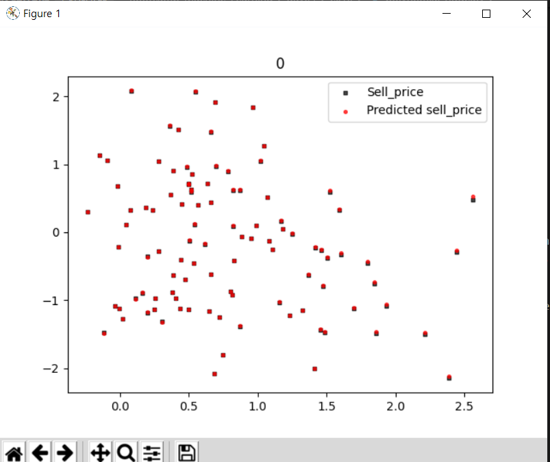


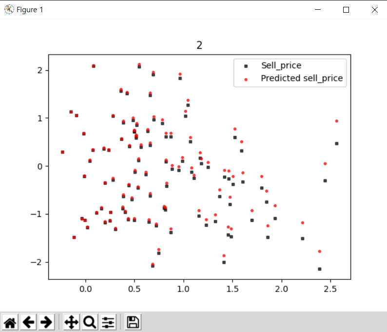
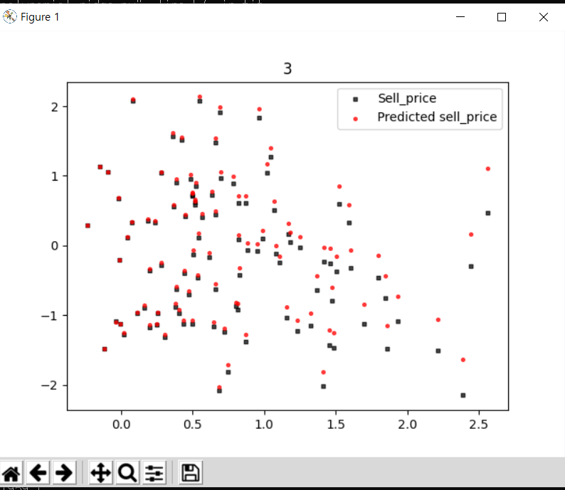
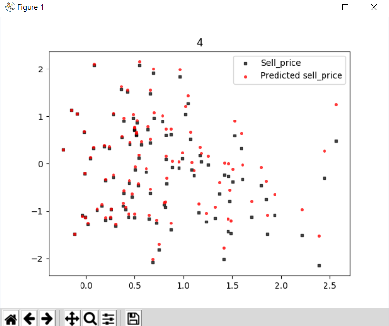
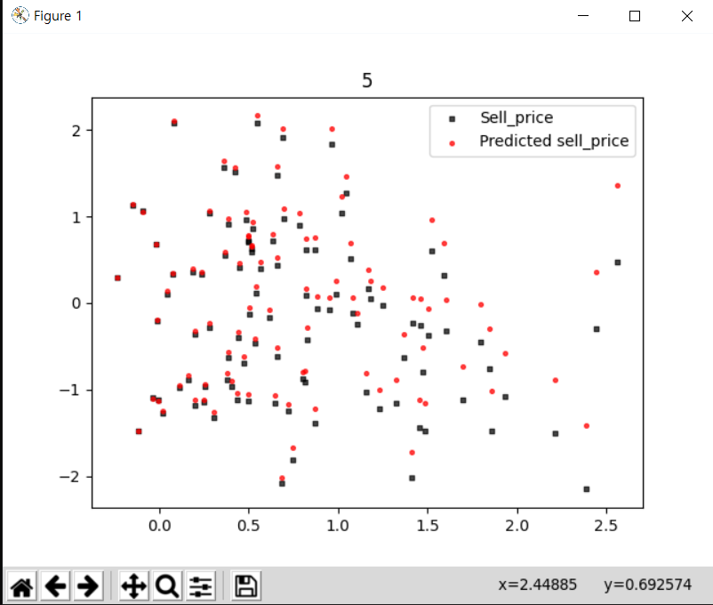

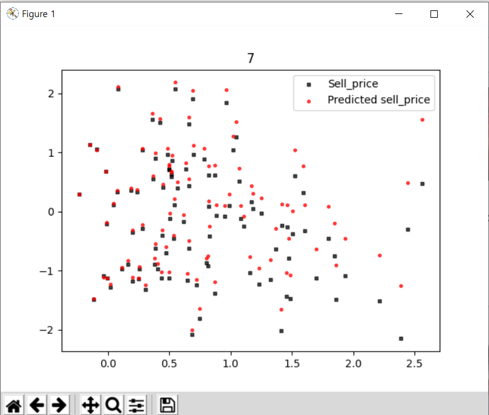
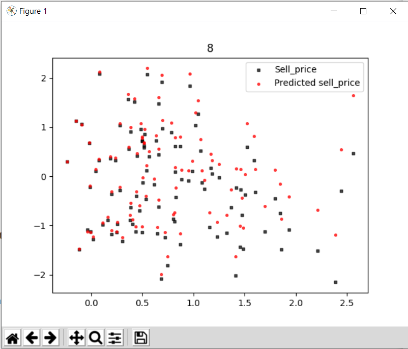
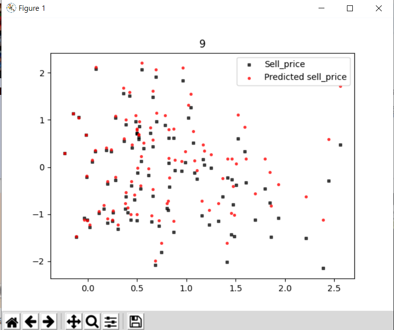


테스트셋과 훈련 셋을 나눴음에도 불구하고 압도적으로 람다가 0일때 정확한 그래프가 그려진다.

아마 내가 설정한 alpha값과 n_cycle이 부족하기 때문일것이다. 내가 설정한 모델에선 람다가 커질수록 그래프의 예측률은 떨어진다.


## Interlude - Regularized Logistic Regression is still Logistic Regression

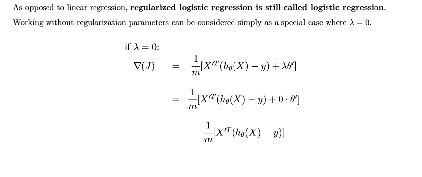

**logistic** **regression에** **regularization을** 한 것은 여전히 **logistic** **regression이라** 불린다.

## ex11

### Regularized Logistic Regression

목표 : 이전에 구현한 Logistic Regression에 penalty 파라미터를 추가하자

penalty의 default는 'L2'이다.

```python
# **************************************************************************** #
#                                                                              #
#                                                         :::      ::::::::    #
#    my_logistic_regression.py                          :+:      :+:    :+:    #
#                                                     +:+ +:+         +:+      #
#    By: dochoi <dochoi@student.42seoul.kr>         +#+  +:+       +#+         #
#                                                 +#+#+#+#+#+   +#+            #
#    Created: 2020/05/30 02:00:53 by dochoi            #+#    #+#              #
#    Updated: 2020/06/01 01:33:34 by dochoi           ###   ########.fr        #
#                                                                              #
# **************************************************************************** #

import numpy as np
import math


class MyLogisticRegression(object):
    """ Description: My personnal logistic regression to classify things. """

    def __init__(self, thetas, alpha=0.0001, n_cycle=5000, penalty='l2', lambda_=0.5):
        self.alpha = alpha
        self.n_cycle = n_cycle
        self.penalty=penalty
        self.thetas = np.array(thetas, dtype=float).reshape(-1, 1)
        self.lambda_ = lambda_

    def l2(self, theta):
        if len(theta) == 0:
            return None
        l2_lst = theta * theta
        return np.sum(l2_lst) - l2_lst[0]

    def add_intercept(self,x):
        if len(x) == 0 or x.ndim >= 3:
            return None
        if x.ndim == 1:
            return np.vstack((np.ones(len(x)), x)).T
        else:
            return np.insert(x, 0, 1, axis=1)

    def log_gradient(self, x, y):
        if len(x) == 0 or len(y) == 0 or len(self.thetas) == 0:
            return None
        if self.penalty == 'l2':
            answer = self.add_intercept(x).T @ (self.predict_(x) - y) + (self.lambda_ * self.thetas)
            answer[0] -= self.lambda_ * self.thetas[0]
            return answer / len(x)
        else:
            return np.sum(self.add_intercept(x).T @ (self.predict_(x) - y) / len(x),axis=1).reshape(-1,1)

    def fit_(self, x, y):
        if len(x) == 0 or len(y) == 0 or len(self.thetas) == 0:
            return None
        n_cycle= self.n_cycle
        while n_cycle:
            self.thetas -= self.alpha * ((self.log_gradient(x, y)))
            n_cycle -= 1
        return self.thetas

    def predict_(self,x):
        if (len(x) == 0 or len(self.thetas) == 0 or x.shape[1] != (len(self.thetas) - 1)):
            return None
        return 1 / (1 + pow(math.e, -self.add_intercept(x) @ self.thetas))

    def cost_(self, x, y, eps=1e-15):
        if (len(y) != len(x) or len(y) == 0 or len(x) == 0):
            return None
        y_hat = self.predict_(x) - eps
        if self.penalty == 'l2':
            return -sum((y * np.log(y_hat)) + ((1 - y) * np.log(1 - y_hat)) ).squeeze() / len(y_hat) + (self.lambda_ * self.l2(self.thetas)/(2 * len(y_hat)))
        else :
            return -sum((y * np.log(y_hat)) + ((1 - y) * np.log(1 - y_hat)) ).squeeze() / len(y_hat)

```


## ex12

### Practicing Regularized Logistic Regression

- Train ten different Logistic Regression models with a polynomial hypothesis of degree 3. The models will be trained with different  θ values, ranging from 0 to 1. Use one-vs-all method.

- Evaluate the f1 score of each of the ten models on the test set. You can use the f1_score_ function that
  you wrote in the ex11 of day03.

- To properly visualize your results, make a bar plot showing the score of the models given their (λ)value.

According to your evaluations, what is the best hypothesis (or model) you can get?

마지막 문제이다. 

역시 degree를 3으로 해야한다., 변수도 3개이니 theta는 10개여야 한다.

사람의 체중, 키, 골밀도, 3가지 변수로 4가지의 지역으로 분류해야한다.

과연 얼마나 적중할까?

```python
# **************************************************************************** #
#                                                                              #
#                                                         :::      ::::::::    #
#    log_reg_model.py                                   :+:      :+:    :+:    #
#                                                     +:+ +:+         +:+      #
#    By: dochoi <dochoi@student.42seoul.kr>         +#+  +:+       +#+         #
#                                                 +#+#+#+#+#+   +#+            #
#    Created: 2020/05/30 02:56:12 by dochoi            #+#    #+#              #
#    Updated: 2020/06/01 01:55:02 by dochoi           ###   ########.fr        #
#                                                                              #
# **************************************************************************** #

import numpy as np
import math
import pandas as pd
import matplotlib.pyplot as plt
from my_logistic_regression import MyLogisticRegression as MyLR
from data_spliter import data_spliter
from polynomial_model_extended import add_polynomial_features

def accuracy_score_(y, y_hat):
    """ Compute the accuracy score.
    Args:
    y:a numpy.ndarray for the correct labels y_hat:a numpy.ndarray for the predicted labels
    Returns: The accuracy score as a float. None on any error.
    Raises: This function should not raise any Exception. """
    return np.count_nonzero(y==y_hat) / float(len(y))

def precision_score_(y, y_hat, pos_label=1):
    """ Compute the precision score.
    Args:
    y:a numpy.ndarray for the correct labels
    y_hat:a numpy.ndarray for the predicted labels
    pos_label: str or int,
    the class on which to report the precision_score (default=1)
    Returns: The precision score as a float.
    None on any error.
    Raises: This function should not raise any Exception. """
    if np.count_nonzero(y_hat == pos_label) == 0:
        return 0
    return np.count_nonzero((y_hat == y) & (y_hat == pos_label)) / float(np.count_nonzero(y_hat==pos_label))

def recall_score_(y, y_hat, pos_label=1):
    """ Compute the recall score.
    Args: y:a numpy.ndarray for the correct labels
    y_hat:a numpy.ndarray for the predicted labels
    pos_label: str or int, the class on which to report the precision_score (default=1)
    Returns: The recall score as a float. None on any error.
    Raises: This function should not raise any Exception. """

    return  np.count_nonzero((y_hat == y) & (y_hat == pos_label)) / float(np.count_nonzero((y_hat == y) & (y_hat == pos_label)) + np.count_nonzero((y_hat != y) & (y_hat != pos_label)))

def f1_score_(y, y_hat, pos_label=1):
    """ Compute the f1 score. Args: y:a numpy.ndarray for the correct labels
    y_hat:a numpy.ndarray for the predicted labels
    pos_label: str or int, the class on which to report the precision_score (default=1)
    Returns: The f1 score as a float. None on any error.
    Raises: This function should not raise any Exception"""
    pre =precision_score_(y,y_hat, pos_label=pos_label)
    re = recall_score_(y,y_hat, pos_label=pos_label)
    if (pre * re) == 0:
        return 0
    return 2 * pre * re / (pre + re)

def zscore(x):
    if len(x) == 0:
        return none
    mu = sum(x)/len(x)
    temp = 0.0
    for elem in x:
        temp += ((elem - mu) * (elem - mu))
    var = temp
    std = np.sqrt(var/ (len(x) - 1))
    return (x - mu) / std

csv_data_x = pd.read_csv("../resources/solar_system_census.csv")

csv_data_y = pd.read_csv("../resources/solar_system_census_planets.csv")

x = np.array(csv_data_x[["height","weight","bone_density"]])
y =  np.array(csv_data_y["Origin"]).reshape(-1,1)

x = zscore(x)


temp = data_spliter(x, y, 0.5)
x_train = temp[0]
x_test = temp[1]
y_train = temp[2]
y_test = temp[3]

x_test_add_poly = add_polynomial_features(x_test, 3) # degree를 3으로 한다.
x_train_add_poly = add_polynomial_features(x_train, 3)
x = add_polynomial_features(x,3)

y_train0 = np.array([1 if i == 0 else 0 for i in y_train]).reshape(-1,1) #각각의 분류모델 데이터 전처리
y_test0 = np.array([1 if i == 0 else 0 for i in y_test]).reshape(-1,1)

y_train1 = np.array([1 if i == 1 else 0 for i in y_train]).reshape(-1,1) #각각의 분류모델 데이터 전처리
y_test1 = np.array([1 if i == 1 else 0 for i in y_test]).reshape(-1,1)

y_train2 = np.array([1 if i == 2 else 0 for i in y_train]).reshape(-1,1) #각각의 분류모델 데이터 전처리
y_test2 = np.array([1 if i == 2 else 0 for i in y_test]).reshape(-1,1)

y_train3 = np.array([1 if i == 3 else 0 for i in y_train]).reshape(-1,1) #각각의 분류모델 데이터 전처리
y_test3 = np.array([1 if i == 3 else 0 for i in y_test]).reshape(-1,1)
theta = np.array([[1],
    [1],
    [ 1],
    [1],[1],[ 1],[ 1],[ 1],[ 1],[ 1]], dtype=float)
mylr0 = MyLR(theta, lambda_=0) # The flying cities of Venus (0)
mylr1 = MyLR(theta, lambda_=0) #  United Nations of Earth (1)
mylr2 = MyLR(theta, lambda_=0) # Mars Republic (2)
mylr3 = MyLR(theta, lambda_=0) # The Asteroids’ Belt colonies (3).
y_n = []
y_n2= []
for i in range(10):
    mylr0.thetas = np.array(  [[-0.38004857],
    [ 0.12257596],
    [-1.13496089],
    [ 0.64144711],
    [ 0.13721429],
    [-0.46771826],
    [-1.18485222],
    [-0.46742162],
    [ 0.03928006],
    [-0.1718098 ]])
    mylr0.fit_(x_train_add_poly, y_train0)
    mylr0.alpha = 0.00003
    mylr0.fit_(x_train_add_poly, y_train0)
    mylr0.alpha = 0.00007
    mylr0.fit_(x_train_add_poly, y_train0)
    mylr0.alpha = 0.0001
    mylr0.fit_(x_train_add_poly, y_train0)
    mylr0.lambda_ += 0.1

    mylr1.thetas = np.array( [[-0.79899142],
    [-0.3785926 ],
    [ 1.24131593],
    [ 1.13327427],
    [-0.73841759],
    [-0.79814797],
    [ 0.03383971],
    [-0.40336806],
    [-0.76538218],
    [ 0.75970411],])

    mylr1.fit_(x_train_add_poly, y_train1)
    mylr1.alpha = 0.00003
    mylr1.fit_(x_train_add_poly, y_train1)
    mylr1.alpha = 0.00007
    mylr1.fit_(x_train_add_poly, y_train1)
    mylr1.alpha = 0.0001
    mylr1.fit_(x_train_add_poly, y_train1)
    mylr1.lambda_ += 0.1

    mylr2.thetas = np.array([[-1.01133034],
    [ 0.43171802],
    [ 1.63911229],
    [ 0.20881501],
    [-1.05478397],
    [ 0.30739429],
    [-1.12331241],
    [ 0.09578607],
    [ 0.84076726],
    [ 0.25000609],])

    mylr2.fit_(x_train_add_poly, y_train2)
    mylr2.alpha = 0.00003
    mylr2.fit_(x_train_add_poly, y_train2)
    mylr2.alpha = 0.00007
    mylr2.fit_(x_train_add_poly, y_train2)
    mylr2.alpha = 0.0001
    mylr2.fit_(x_train_add_poly, y_train2)
    mylr2.lambda_ += 0.1

    mylr3.thetas = np.array([[-1.37659546],
    [ 0.88245098],
    [ 0.06049297],
    [-0.38618096],
    [-0.22685866],
    [-1.05910852],
    [-0.12425495],
    [ 0.76153196],
    [-0.61360801],
    [-1.65141989]])

    mylr3.fit_(x_train_add_poly, y_train3)
    mylr3.alpha = 0.00003
    mylr3.fit_(x_train_add_poly, y_train3)
    mylr3.alpha = 0.00007
    mylr3.fit_(x_train_add_poly, y_train3)
    mylr3.alpha = 0.0001
    mylr3.fit_(x_train_add_poly, y_train3)
    mylr3.lambda_ += 0.1

    print(mylr0.thetas)
    print(mylr1.thetas)
    print(mylr2.thetas)
    print(mylr3.thetas)
    # 모델 생성 완료
    # 테스트 데이터 예측
    y_hat0 = mylr0.predict_(x_test_add_poly)
    y_hat1 = mylr1.predict_(x_test_add_poly)
    y_hat2 = mylr2.predict_(x_test_add_poly)
    y_hat3 = mylr3.predict_(x_test_add_poly)


    y_hat_total = np.append(y_hat0, y_hat1, axis=1)
    y_hat_total = np.append(y_hat_total, y_hat2, axis=1)
    y_hat_total = np.append(y_hat_total, y_hat3, axis=1)

    y_hat_pre_all = np.array([])
    # 데이터 확률 최댓값을 기준으로 클래스 분류
    for i in range(len(y_hat_total)):
        y_hat_pre_all = np.append(y_hat_pre_all, np.argmax(y_hat_total[i]))

    y_hat_pre_all = y_hat_pre_all.reshape(-1,1)

    print(mylr0.cost_(x_test_add_poly,y_test0))
    print(mylr1.cost_(x_test_add_poly,y_test1))
    print(mylr2.cost_(x_test_add_poly,y_test2))
    print(mylr3.cost_(x_test_add_poly,y_test3))
    y_n.append(f1_score_(y_test, y_hat_pre_all))
    y_n2.append(accuracy_score_(y_test, y_hat_pre_all))
    # np.set_printoptions(formatter={'float_kind': lambda x: "{0:0.3f}".format(x)})

    # 시각화
plt.bar(range(0,10), y_n ,color=['black', 'red', 'green', 'blue','black', 'red', 'green', 'blue','black', 'red'])


plt.xlabel('lambda 0, 0.1, 0.2 ,..., 0.9')
plt.xticks(range(0,10))
plt.ylabel('f_score')
plt.ylim()
plt.title('**f_score for lambda change*')
plt.show()
print(y_n)
plt.bar(range(0,10), y_n2 ,color=['black', 'red', 'green', 'blue','black', 'red', 'green', 'blue','black', 'red'])

print(y_n2)
plt.xlabel('lambda 0, 0.1, 0.2 ,..., 0.9')
plt.xticks(range(0,10))
plt.ylabel('accuracy_score_')
plt.ylim()
plt.title('**accuracy_score_ for lambda change*')
plt.show()

```

마지막 문제 답게 지금까지 했던것들이 거의 다 쓰인다.

데이터 분리, 정규화, f_score, add_poly...

내가 구현한 과정은 이러하다.

1. 데이터를 받아온다.
2. 데이터를 정규화한다.
3. 데이터를 훈련셋과 테스트셋으로 나눈다.
4. 데이터의 degree를 3으로 늘려준다.
5. one vs all 방법으로 4가지 분류기을 만든다.
6. 이 4가지 분류기 중에서 확률이 제일 높은게 정답이라고 가정한다.
7. lamda를 바꿔가며 fit을 진행한다.
8. 결과를 시각화한다.

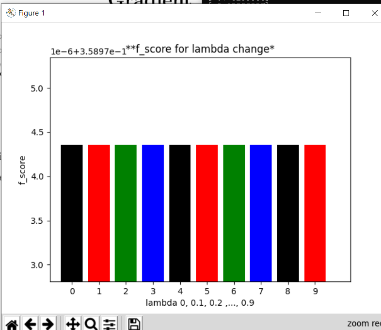

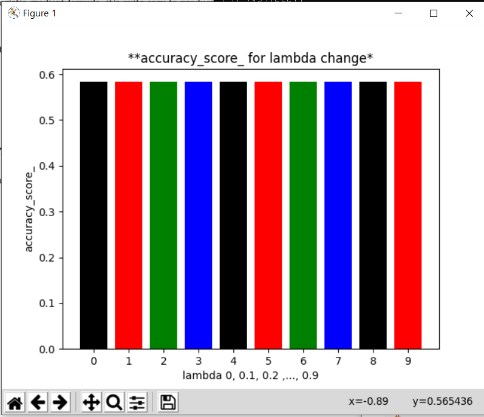

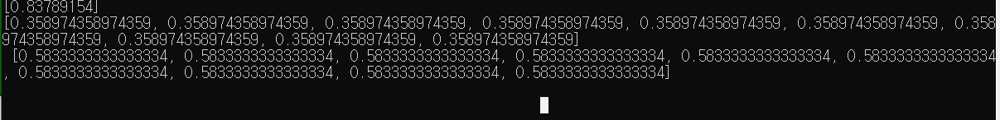

흠 뭔가 이상하다.. lambda가 바뀌어도 theta값은 바뀌는데 accuaracy와  f_score 값이 동일하다.

확인해봤더니 theta값은 모델마다 전부 다르다.. 아마 시간을 더 들여서 n_cycle과 alpha를 좀더 세심히 하면 다른 결과가 나올수도 있을것 같다.

우선 4개로 분류하는 모델은 맞출 확률이 58%이다... 랜덤으로 맞추면 25%인거에 비하면 꽤나 괜찮은거 같기도 하다.

역시 마지막이라 난이도가 좀 있었다.

시간이 좀 많이 걸렸다.

이로써 Bootcamp Machine Learning이 모두 끝났다.

이제 나도 나만의 모델을 만들 수 있는 것이다!!

