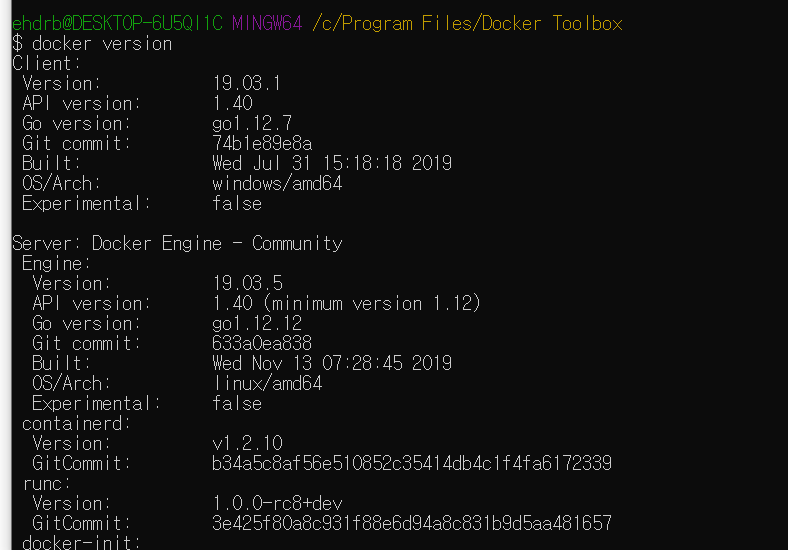
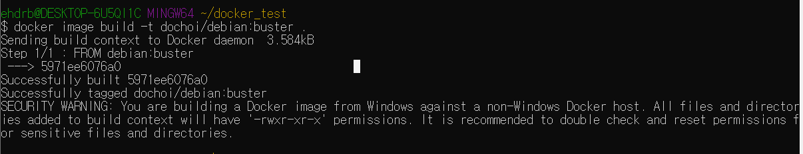
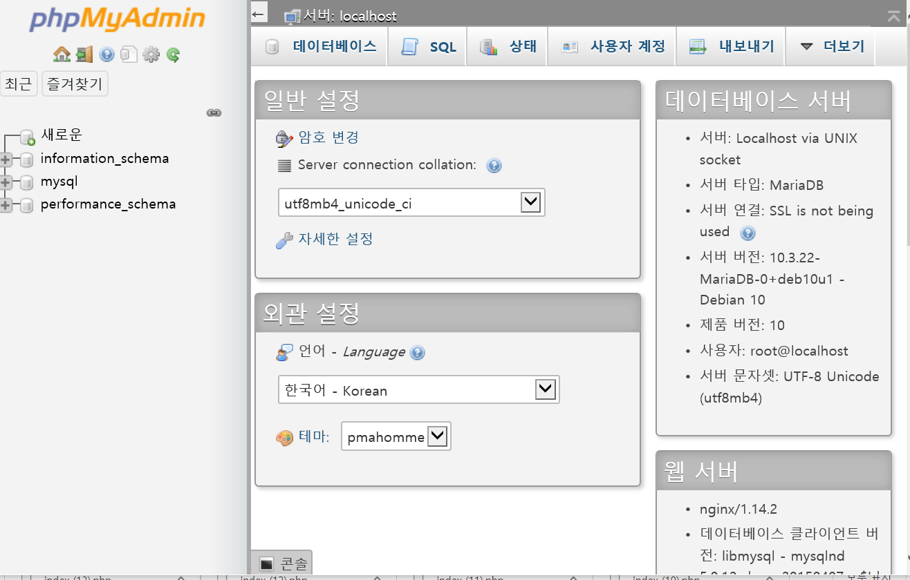
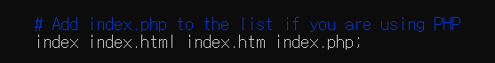

# ft_server 진행과정

한달 전  docker에대한 이해도가 부족할때 우분투 환경에서 ft_server프로젝트를 초반부 진행하였다.  하지만 진전없이 그 이후로 시간이 많이 지났다. 

나에게 익숙한 운영체제는 Windows고 대부분의 사람들은 Windows를 사용한다. 또한 dockerfile은 어느 운영체제에서도 동일하게 작용하여야 하기 때문에 Windows환경에서 프로젝트를 끝낸후 Mac 환경에서 Dockerfile을 테스트 해 볼 생각이다. 이전의 경험을 통해 나중에 동일한 작업을 쉽게 하기 위해 과정을 남겨둔다.

## 프로젝트 내용

- **docker를 이용하여 간단한 웹 서버를 구축한다.**

- 이 웹 서버는 **Wordpress, phpMyAdmin, SQL database**를 실행시킬 수 있어야한다.

- repository root에는 Dockerfile을 제출하여야 하며 **docker-compose는 사용할 수 없다.**

- WordPress website를 위한 파일과 기타 파일은 ./srcs에 제출한다.
- 웹 서버는 **nginx**로 구축하며 하나의 컨테이너를 이용한다. OS는 **debian buster**이다.
- 웹서버는 동시에 Wordpress, phpMyAdmin, SQL database를 실행할 수 있어야 하며 SQL database는 WordPress 와 phpMyAdmin과 같이 작동하여야 한다.
- 웹 서버는 **SSL protocol**을 사용할 수 있어야 한다.
- 모두 끝났다면 **url**에 따라 올바르게 **redirection**이 되는지 확인한다.
- 서버는 **autoindex**로 실행되어야 하며 이는 **비활성화** 할 수 있어야 한다.

## 윈도우용 도커 설치

윈도우용/macOs용 도커는 stable버전과 edge버전으로 나뉘어 제공된다.

(edge버전에는 실험적 최신 기술이 담겨있다.)

https://hub.docker.com/editions/community/docker-ce-desktop-windows


stable 버전을 다운로드 받는다.


실패하였다. 


내 윈도우 버전을 확인해 본다. **내 윈도우 버전과 맞지 않는다.**

윈도우 10 Enterprise/Professional 이전 버전의 윈도우 사용자는 툴박스를 이용해서 설치하여야한다. 기능은 동일하다. 

https://docs.docker.com/toolbox/toolbox_install_windows/

왜 이렇게 귀찮게 버전별로 docker다운방법이 나누어져 있을까?

docker는 리눅스 기반의 프로그램이다. 윈도우에서 실행하기 위해선 가상화 기능이 필요하다.

윈도우 10 Enterprise/Professional 에서는 docker와 연동될수 있게 되어있다.

하지만 Home버전은 가상머신을 이용해야한다. 따라서

툴박스를 이용하여 윈도우 위에 리눅스 가상머신을 돌리고 여기서 도커엔진을 실행한다. 사실 듀얼부팅으로 리눅스가 깔려있어서 리눅스에서 해도 되지만 내 컴퓨터에서 리눅스는 조금 불안정하다.(갑자기 먹통이 된다..) 윈도우에서 진행해도 기능에 이상이 없으니 윈도우로 진행한다.

**도커를 실행하려면 가상화를 해야하기 때문에 작업 관리자를 켜서 성능탭의 가상화가 "사용"으로 되어있는지 확인한다.**


가상화를 사용으로 바꿔준다.



docker version으로 제대로 설치되었는지 확인한다.


## Debianbuster 이미지 받아오기

```
docker image pull debian:buster
```

이를 도커파일로 작성하면

```dockerfile
FROM debain:buster
```

이다. dockerfile의 첫 줄이 완성되었다.


이미지가 pull이 되었는지 확인한다.


이미지를 빌드하자



```
docker image build -t dochoi/debian:buster .
```

**-t옵션을 주어 이름을 지정한다. 네임스페이스는 dochoi이며 현재폴더에 빌드한다.**

빌드가 완료되었다 WARNING는 무시해도 된다.


## Debianbuster 컨테이너 실행

```
docker container run -it -p 9000:8080 dochoi/debian:buster  
```

`-it` :  docker 이미지 컨테이너의 bash 쉘을 실행 시킨다

- `-i` : interactive
- `-t` : 가상 tty(터미널같은입력창) 할당

`-p`:  로컬호스트 9000 -> 컨테이너호스트 8000 연결


## Nginx설치


```
$ apt update
```

```
$ apt upgrade
```

```
$ apt install nginx
```


지금까지의 과정을 도커파일로 나타내보자 도커파일에선 apt를 apt-get으로 써야 워닝이 안뜬다

```dockerfile
FROM debian:buster

# Install Nginx

RUN apt-get update
RUN apt-get upgrade
RUN apt-get install -y nginx
```

RUN 인스트럭션은 도커 이미지를 실행할 때 컨테이너 안에서 실행할 명령을 정의한다.

update와 upgrade는 패키지 최신버전이 있는지 확인(update)하고 업그레이드한다.

위에서의 과정과 동일하게 하며 -y옵션은 y/n에서 y를 선택한다는 뜻이다.

```
$ apt install vim
```

파일을 수정하기위해 vim을 설치해준다.

```
/etc/nginx/sites-available/default
```

이곳의 포트번호를 원하는대로 설정해준다 
포트포워딩 9000->80으로 했었으므로 80을 그대로둔다

```nginx
server {
        listen 80 default_server;
        listen [::]:80 default_server;

        # SSL configuration
        #
        # listen 443 ssl default_server;
        # listen [::]:443 ssl default_server;
        #
        # Note: You should disable gzip for SSL traffic.
        # See: https://bugs.debian.org/773332
        #
        # Read up on ssl_ciphers to ensure a secure configuration.
        # See: https://bugs.debian.org/765782
        #
        # Self signed certs generated by the ssl-cert package
        # Don't use them in a production server!
        #
        # include snippets/snakeoil.conf;
    
        root /var/www/html;
    
        # Add index.php to the list if you are using PHP
        index index.html index.htm index.nginx-debian.html;
    
        server_name _;
    
        location / {
                # First attempt to serve request as file, then
                # as directory, then fall back to displaying a 404.
                try_files $uri $uri/ =404;
        }
    
        # pass PHP scripts to FastCGI server
        #
        #location ~ \.php$ {
        #       include snippets/fastcgi-php.conf;
        #
        #       # With php-fpm (or other unix sockets):
        #       fastcgi_pass unix:/run/php/php7.3-fpm.sock;
        #       # With php-cgi (or other tcp sockets):
        #       fastcgi_pass 127.0.0.1:9000;
        #}
    
        # deny access to .htaccess files, if Apache's document root
        # concurs with nginx's one
        #
        #location ~ /\.ht {
        #       deny all;
        #}

}
```

접속해보자 

```
$ nginx -t
$ service nginx start
$ service nginx stop
$ service nginx restart
```

nginx -t로 ini 파일에 에러가 있는지 확인한다.

나처럼 윈도우가 아닌 환경에선 

127.0.0.1:9000으로 접속이 가능하지만 

가상환경에선

localhost가 192.168.99.100

이기 때문에

192.168.99.100:9000으로 들어가 본다


성공하였다.


## mySQL설치

mysql을 설치해보자 

데비안 10에서는 mariadb가 기본이다 하지만 과제에서 mysql을 설치하라고 하니

설치방법을 찾아봤다. 무수한 실패끝에

mariaDB를 설치하기로 하였다..

```
apt install -y mariadb-server

apt install -y php-mysql 
```

## phpmyadmin 설치


```
apt install wget -y
apt install php-fpm - y
wget https://files.phpmyadmin.net/phpMyAdmin/5.0.2/phpMyAdmin-5.0.2-all-languages.zip
mv phpMyAdmin-5.0.2-all-languages.zip /var/www/html/phpmyadmin/
```

phpmyadimn은 사이트에서 다운로드 받아야한다.

그러기 위해 wget을 설치하여 다운로드 받은 후 mv 명령어로 이동시켜준다.(unzip을 설치해주어야한다.)

mbstring + curl 설치

```
$ apt install php-mbstring

$ apt install php-curl
```

 참고([https://syudal.tistory.com/entry/Ubuntu-1804%EC%97%90-Nginx-PHP-MariaDB-phpmyadmin-%EC%84%A4%EC%B9%98%ED%95%98%EA%B8%B0](https://syudal.tistory.com/entry/Ubuntu-1804에-Nginx-PHP-MariaDB-phpmyadmin-설치하기))

```nginx
##
# You should look at the following URL's in order to grasp a solid understanding
# of Nginx configuration files in order to fully unleash the power of Nginx.
# https://www.nginx.com/resources/wiki/start/
# https://www.nginx.com/resources/wiki/start/topics/tutorials/config_pitfalls/
# https://wiki.debian.org/Nginx/DirectoryStructure
#
# In most cases, administrators will remove this file from sites-enabled/ and
# leave it as reference inside of sites-available where it will continue to be
# updated by the nginx packaging team.
#
# This file will automatically load configuration files provided by other
# applications, such as Drupal or Wordpress. These applications will be made
# available underneath a path with that package name, such as /drupal8.
#
# Please see /usr/share/doc/nginx-doc/examples/ for more detailed examples.
##

# Default server configuration
#
server {
        listen 80 default_server;
        listen [::]:80 default_server;

        # SSL configuration
        #
        # listen 443 ssl default_server;
        # listen [::]:443 ssl default_server;
        #
        # Note: You should disable gzip for SSL traffic.
        # See: https://bugs.debian.org/773332
        #
        # Read up on ssl_ciphers to ensure a secure configuration.
        # See: https://bugs.debian.org/765782
        #
        # Self signed certs generated by the ssl-cert package
        # Don't use them in a production server!
        #
        # include snippets/snakeoil.conf;

        root /var/www/html;

        # Add index.php to the list if you are using PHP
        index index.html index.htm index.nginx-debian.html index.php;

        server_name _;

        location / {
                # First attempt to serve request as file, then
                # as directory, then fall back to displaying a 404.
                try_files $uri $uri/ =404;
        }

        #pass PHP scripts to FastCGI server
        #
        location ~ \.php$ {
                include snippets/fastcgi-php.conf;
        #
        #       # With php-fpm (or other unix sockets):
                fastcgi_pass unix:/run/php/php7.3-fpm.sock;
        #       # With php-cgi (or other tcp sockets):
        #       fastcgi_pass 127.0.0.1:9000;
        }

        # deny access to .htaccess files, if Apache's document root
        # concurs with nginx's one
        #
        #location ~ /\.ht {
        #       deny all;
        #}
}


# Virtual Host configuration for example.com
#
# You can move that to a different file under sites-available/ and symlink that
# to sites-enabled/ to enable it.
#
#server {
#       listen 80;
#       listen [::]:80;
#
#       server_name example.com;
#
#       root /var/www/example.com;
#       index index.html;
#
#       location / {
#               try_files $uri $uri/ =404;
#       }
#}
```

```
/etc/nginx/sites-available/default
```

파일을 수정한다.


```
service nginx start

service mysql start

service php7.3-fpm start
```


```
$ mysql_secure_installation

 

Enter current password for root (enter for none): → 엔터

Set root password? [Y/n] → Y 이후 사용할 암호 입력

Remove anonymous users? [Y/n] → Y

Disallow root login remotely? [Y/n] → N

Remove test database and access to it? [Y/n] → N

Reload privilege tables now? [Y/n] → Y
```

```
$ mysql -u root -p

use mysql;

update user set plugin='' where user='root';

flush privileges;

quit;
```



들어가졌다.

이로써 mysql, nginx, phpmyadmin 세팅이 끝났다.

## wordpress를 설치

```
https://ko.wordpress.org/wordpress-4.9.7-ko_KR.zip
```

phpmyadmin 과 유사하게 해준다.


완료하였다. 이로써 wordpress까지 끝이 났다


# Nginx에서 SSL(HTTPS) 보안 서버 설정하기

필요한 파일들

- Certificate (*.crt)
- Private Key (*.key)

- RSA 기반의 private key 생성

cd /etc/pki/tls/private

openssl genrsa -des3 -out test.key 1024


- CSR(Certificate Signing Request) 생성

```
openssl req -new -key test.key -out test.csr
```


- Remove Passphrase from key


```
cp test.key test.key.enc
openssl rsa -in test.key.enc -out test.key
```

\-   개인키를 보호하기 위해 Key-Derived Function 으로 개인키 자체가 암호화되어 있다. 

하지만 SSL 에 사용하려는 키가 암호가 걸려있으면 httpd 구동때마다 pass phrase 를 입력해야 하므로 암호를 제거한다.


- self-signed 인증서 생성


openssl x509 -req -days 365 -in test.csr -signkey test.key -out test.crt


- 제대로 생성되었는지 확인을 위해 인증서의 정보를 출력해 본다.

openssl x509 -text -in test.crt 

[https://keithus.tistory.com/entry/OpenSSL-self-signed-certificate-%EC%83%9D%EC%84%B1](https://keithus.tistory.com/entry/OpenSSL-self-signed-certificate-생성)

이곳을 참고하여  인증서를 만든다

```

-----BEGIN CERTIFICATE-----
MIICijCCAfMCFGZU6XpVe1X99h2MTO6XQLyuMr1lMA0GCSqGSIb3DQEBCwUAMIGD
MQswCQYDVQQGEwJLUjEOMAwGA1UECAwFU2VvdWwxDjAMBgNVBAcMBVNlb3VsMQ8w
DQYDVQQKDAZkb2Nob2kxDzANBgNVBAsMBmRvY2hvaTEPMA0GA1UEAwwGZG9jaG9p
MSEwHwYJKoZIhvcNAQkBFhJlaGRyYjM0NUBuYXZlci5jb20wHhcNMjAwNTIwMTQz
NTM1WhcNMjEwNTIwMTQzNTM1WjCBgzELMAkGA1UEBhMCS1IxDjAMBgNVBAgMBVNl
b3VsMQ4wDAYDVQQHDAVTZW91bDEPMA0GA1UECgwGZG9jaG9pMQ8wDQYDVQQLDAZk
b2Nob2kxDzANBgNVBAMMBmRvY2hvaTEhMB8GCSqGSIb3DQEJARYSZWhkcmIzNDVA
bmF2ZXIuY29tMIGfMA0GCSqGSIb3DQEBAQUAA4GNADCBiQKBgQDl2se34qCIY6Zg
t1qLaY2J5lG1dl6g/P+sQRg0RJpgzp+u9N0uJQAttZygFRm5QaDTKkabRQhR3Wux
8zTkzoGrEMnfT4jPvfoVIBHZ4yUjw3XoJpL4+A+s4ybyodnxxjYEuoYm6rPAk3eC
PBm414iOfaxm8gFhl5THAOO9R4AfwQIDAQABMA0GCSqGSIb3DQEBCwUAA4GBAN89
bvxxIEqtlRgMjBSITRvy8HtfbLdHMrG2j7mKI4oO7LGF7kZGS+FIlphWPveS8Tjm
49jjbSAdeKd6wqIRolFtAxfToNMIe5FRxTz0NjstE+msbSKLPz31HC4wy3phx8Hi
TQ704NGsvMjnsJZGhzBDrBM1k6+cc5YV5uVQnvPZ
-----END CERTIFICATE-----
dochoi@DESKTOP-6U5QI1C:/mnt/c/Users/ehdrb/docker_test$
```


**nginx: [emerg] SSL_CTX_use_certificate("/root/test.crt") failed (SSL: error:140AB18F:SSL routines:SSL_CTX_use_certificate:ee key too small)**
**nginx: configuration file /etc/nginx/nginx.conf test failed....**

에러가 났다. 원인은 너무 작은 수의 키이다.

#### **1024가아닌 2048로 만들어야 에러가 안난다...** 


http 를 https 로 리다이렉션한다

https://velog.io/@minholee_93/Nginx-HTTPS-SSL

참고..

defalut 파일에 location{} 속에 auto index on을 추가한다.



이곳에 적힌 파일이 location에없어야 auto index가 적용되니 수정해준다.


### 윈도우 스크립스작성시 유의사항

linux 에서 스크립트 실행할 때
/bin/sh^M: bad interpreter: No such file or directory
와 같은 에러 메시지가 나타날 때가 있다.

이것은 십중 팔구 윈도우에서 스크립트 파일을 만든 뒤, linux 에서 실행했기 때문에 나타나는 오류이다.
정확히는 줄 끝 (줄바꿈)을 의미하는 개행문자가 달라서 발생하는 문제인데 이것의 해결을 위해서는 다음의 방법 중 한 가지로 처리한다.

vi -b

vi 의 바이너리 모드로 들어가면 ^M 이라는 문자가 보인다. 이것을 지워주면 된다.


## 최종 도커파일 작성

mysql설정이 조금 번거롭다..

최종 세팅은 mysql id와 비밀번호를 만들어야 하기 때문에 shell script로 작성하기로 한다.

ENTRYPOINT나 COMMAND를 이용하면 docker가 실행되었다가 꺼지기 때문에 넣지 않기로 한다.


```
FROM debian:buster

# Install Nginx

RUN apt-get update
RUN apt-get upgrade
RUN apt-get install -y nginx
COPY ./srcs/default /etc/nginx/sites-available

# Install MySQL

RUN apt-get install -y mariadb-server
RUN apt-get install -y php-mysql 

# Install phpmyadimn

RUN apt-get install -y wget 
RUN apt-get install -y php-fpm
COPY ./srcs/phpMyAdmin-5.0.2-all-languages.zip .
RUN wget https://files.phpmyadmin.net/phpMyAdmin/5.0.2/phpMyAdmin-5.0.2-all-languages.zip
RUN mkdir /var/www/html/phpmyadmin
RUN apt-get install -y unzip
RUN unzip phpMyAdmin-5.0.2-all-languages.zip
RUN mv phpMyAdmin-5.0.2-all-languages/* /var/www/html/phpmyadmin/

## Install Word Press

RUN apt-get update
RUN apt-get install -y php-curl
RUN apt-get install -y php-gd
RUN apt-get install -y php-intl
RUN apt-get install -y php-mbstring
RUN apt-get install -y php-soap
RUN apt-get install -y php-xml
RUN apt-get install -y php-xmlrpc
RUN apt-get install -y php-zip
COPY ./srcs/wordpress-4.9.7-ko_KR.zip .
RUN unzip wordpress-4.9.7-ko_KR.zip
RUN mv wordpress /var/www/html/

##SSL copy
COPY ./srcs/test.key /root
COPY ./srcs/test.crt /root
COPY ./srcs/init_sql.sql /root
COPY ./srcs/wp-config.php /var/www/html/wordpress/
COPY ./srcs/firststep.sh /root
```
wget을 이용하면 다시 다운로드 받는게 느려서 이미 받아놓은 파일을 호스트에서 컨테이너로 복사하기로 하였다.

들어가서 firststep.sh 만 하면 모든게 완료된다.

이로써 ft_server 프로젝트가 마무리 되었다
