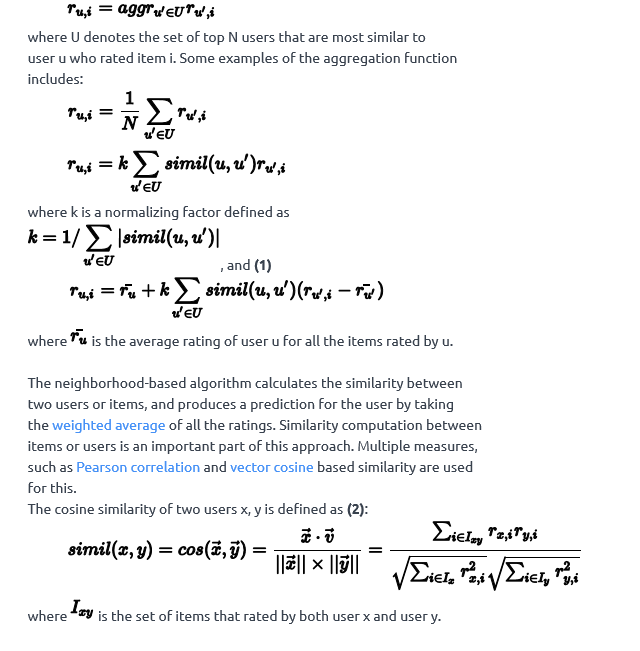
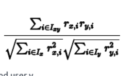
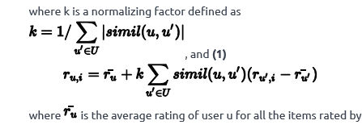
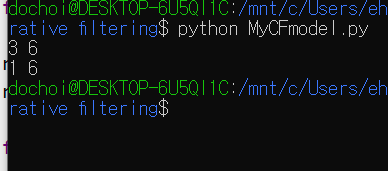
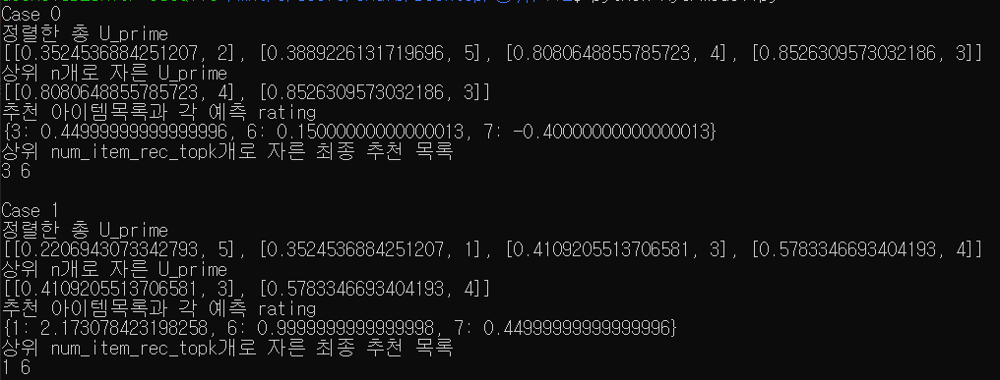

# 추천 시스템 만들기

- [추천 시스템 만들기](#추천-시스템-만들기)
  - [목표](#목표)
  - [Memory_based Collaborative Filtering 은 무엇인가?](#memory_based-collaborative-filtering-은-무엇인가)
  - [**Memory-based methods (aka Neighborhood-based)**](#memory-based-methods-aka-neighborhood-based)
    - [user-based](#user-based)
    - [item-based](#item-based)
    - [User-based 를 이용해 추천 시스템을 만들어보자 !!](#user-based-를-이용해-추천-시스템을-만들어보자-)
    - [우선 input을 어떤 자료구조로 담을 지 결정하자](#우선-input을-어떤-자료구조로-담을-지-결정하자)
    - [simil함수를 구현하자 (식 2)](#simil함수를-구현하자-식-2)
    - [aggregation function를 구현하자 (식 1)](#aggregation-function를-구현하자-식-1)
    - [전체코드](#전체코드)
    - [출력결과 :](#출력결과-)
## 목표

Memory_based Collaborative Filtering 기법중 하나인 User-based Collaborative filtering 알고리즘을 사용해 추천 시스템을 만들어보자

## Memory_based Collaborative Filtering 은 무엇인가?

Collabrative Filtering은 사용자에게 새로운 추천을 추론해주기 위해 Collaborative reserach and process를 한다.

This collaborative research는등급 값 누락에 대한 추측을 하기 위해 user과 item의 유사점을 찾아내고  new recommendations을 추론한다.

CF 기술은 Memore-based 와 Model-base 방법 두가지가 있다.


## **Memory-based methods (aka Neighborhood-based)**

user-based 와 item-based collaborative filtering의 2가지 방법으로 구성된다.


### user-based

- items에대해 유사한 rating을 가진 유사한 users를 찾아서 target user의 rating을 예측한다.

ex)

Alice = {Terminator: 4, Predator: 2, Robocop: 3}

Bob = {Terminator: 4, Predator: 2, Robocop: **?**}

Bob의 로보캅 평가는 몇일까?

아래의 5단계를 거치자

1. target user 명시 ( Bob이 target유저이다.)

2. target user와 비슷한 등급을 매긴 유저를 찾기 (여러명일 수 있다.)
3. target user에서 모르는 rating의 item을 추출한다.
4. 그 item의 rating을 예측한다.
5. 만약 rating이 threshold를 넘으면 target user에게 추천해준다.


### item-based

- 사용자가 이미 rating을 매긴 항목과 유사한 항목을 찾는다.

ex)

Bob = {Matrix: 4, Kill Bill: 3, Terminator: 4}

items Bob not rated= {Robocop, Alien}

Bob에게 무엇을 추천해줄까?

아래의 4단계를 거치자

1. target user 명시 ( Bob이 target유저이다.)
2. target user가 매긴 ratings와 유사한 item을 차는다.
3. 그 item의 rating을 예측한다.
4. 만약 rating이 threshold를 넘으면 target user에게 추천해준다.


둘중에 어떤것을 선택하느냐는 내가 무엇을 원하냐에 따라 달라진다.

그러나 item-based motehds가 user-based 보다 신뢰성이 좋다.

user based는 자신의 선호도를 바꿀 수 있고, 이로인해 user-based는 성능이 저하될 수 있다.

간단히 말해, item-based가 변화에 안정적이며 user_based보다 변경경향이 적다.

그러나 이는 ratings table자료가 충분해야 한다.

ratings table의 크기가 증가하면 시간복잡도가 n^2을 따라 증가한다.


## User-based 를 이용해 추천 시스템을 만들어보자 !!



1번식 :

m = target 유저의 모든 아이템 rating 평균

m' = other 유저의 모든 아이템 rating 평균

k = 정규화 인자

target  유저의 아이템 rating 예측 = m + k * 합(simil함수 * (다른 user의 아이템 rating- m))

이식엔 **target 유저의 rating 경향성**과 **target유저와 다른 user의 유사도**, **other user의 평균 rating과  other user의 아이템 rating과의 편차** , 이 3가지 요소가 wegiht로 들어가 있다.

이제 구현을 해보자

## input을 어떤 자료구조로 담을 지 결정하자

```python
rating_table = [{}] ## 레이팅 테이블

sys.stdin = open("input0.txt", 'r')
num_sim_user_topk = int(input()) # 유사한 유저의 수
num_item_rec_topk = int(input()) # 추천할 아이템의 개수
num_users = int(input()) # 총 유저의 수
for i in range(1, num_users + 1):
    rating_table.append({})
num_items = int(input()) # 총 아이템의 수
num_rows = int(input()) # 총 rating 개수

for i in (range(int(num_rows))):
    temp = input().split()
    rating_table[int(temp[0])][int(temp[1])] = float(temp[2]) # rating_talbe[유저번호][아이템번호][rating값]
num_reco_users = int(input()) # 추천 유저의 수
for i in (range(int(num_reco_users))):
    num_reco_user = int(input())
    U_prime = [] # 최근접 이웃 집합
    for j in range(1, num_users + 1):
        if num_reco_user != j:
            U_prime.append([simil(rating_table[num_reco_user], rating_table[j]), j]) # [simil, 유저번호] appned
    U_prime.sort() # sort
    if len(U_prime) > num_sim_user_topk: # num_sim_user_topk개수만큼 잘라준다.
        del U_prime[:len(U_prime) - num_sim_user_topk]
    reco_dict_ = target_user_rating_predict(num_reco_user ,U_prime)
```

list 에 user별 dict를 배정하는것으로 담기로 했다.


## simil함수를 구현하자 (식 2)



여기서 유의해야 할점은 분모 i는 x와 y의 평가 둘다 있는 item의 집합이고

분자 i는 각각 x에 있는것 y에 있는것 item 집합이다.

즉 3가지의 i집합이 모두 다를 수 있다.

```python
def simil(x,y): # 식 2
    xdotv = 0.0 # 분자, x 와 v 의 dot product
    sum_powx =0.0 # x의 원소의 제곱의 합
    sum_powy = 0.0 # y의 원소의 제곱의 합
    for key in range(1 ,num_items+ 1) :
        if key in y and key in x: # x, y의 key아이템 평가가 동시에 존재하면
            xdotv += x[key] * y[key]
            sum_powx += x[key] * x[key]
            sum_powy += y[key] * y[key]
        elif key in x: # x에만 key평가가 존재하면
            sum_powx += x[key] * x[key]
        elif key in y :# y에만 key평가가 존재하면
            sum_powy += y[key] * y[key]
    sqrt_sum_powx_powy = math.sqrt(sum_powx) * math.sqrt(sum_powy)
    if math.isclose(sqrt_sum_powx_powy , 0.0): # 0으로 나누는 예외처리, 실수 값 비교연산 주의
        return 0
    return xdotv / sqrt_sum_powx_powy
```

## 한 user에 대한 모든 item raitng 평균을 반환하는 함수를 만들자


```python
def mean_rating(user):
    sum_rating  = 0.0
    cnt = 0
    for key in rating_table[user].keys(): # user user_mean_rating 구하기
        sum_rating += rating_table[user][key]
        cnt += 1
    if cnt == 0: #0으로 나누는 예외처리
        return 0
    return sum_rating / cnt
```


## aggregation function를 구현하자 (식 1)



여기서 유의해야할 점은 u`은 item을 rating한 target유저를 제외한 user들의 집합이다.

즉 item 마다 시그마 돌릴 원소(u`)가 바뀔 수 있다. 따라서 item마다 k값을 구해줘야한다.

앞에 **mean_r과** 뒤에 **mean_r`**가 다름에 유의한다.

앞은 **target**의 전체 아이템 rating 평균이고 뒤는 **other**의 전체 아이템 rating 평균이다.

```python
def target_user_rating_predict(t_user,U_prime): # 식 1

    target_user_mean_rating = mean_rating(t_user) # t_user의 rating 평균값
    len_t_user_rating = 0 # t_user의 rating 개수

    k = {} #k를 item마다 구해줘야 하기 때문에 dict를 이용하였다.
    reco_dict = {} #추천 item을 담을 dict

    for i in range(1 ,num_items+ 1) : #추천용 dict 생성(target유저가 평가하지 않고 다른유저가 평가한 아이템 목록 생성)
        for other in U_prime: #  other[simil, 유저번호]
            if i not in rating_table[t_user] and i in rating_table[other[1]]: # targt 유저가 rating하지 않고, 다른유저가 rating한 item만 본다.
                    reco_dict[i] = 0.0
                    k[i] = 0.0

    for i in reco_dict.keys(): #추천 목록 후보들
        for other in U_prime: #  other[simil, 유저번호]
            if i in  rating_table[other[1]]:  #itme을 other users가 평가했으면
                if i in reco_dict:
                    k[i] +=abs(other[0]) #k값 구하기
                    reco_dict[i] +=(other[0] * (rating_table[other[1]][i] - mean_rating(other[1]))) # 1식의 시그마 안쪽 수식

    for key in reco_dict.keys():
        k_i = 0.0
        if not math.isclose(k[key], 0.0): #k값 0으로 나누는 에러 처리 (float 비교연산 주의 )
            k_i = 1 / k[key]
        reco_dict[key] = target_user_mean_rating  + ((k_i) * reco_dict[key]) #1식의 시그마 바깥쪽 수식
    return reco_dict
```


### 전체코드

```python
# **************************************************************************** #
#                                                                              #
#                                                         :::      ::::::::    #
#    MyCFmodel.py                                       :+:      :+:    :+:    #
#                                                     +:+ +:+         +:+      #
#    By: dochoi <dochoi@student.42seoul.kr>         +#+  +:+       +#+         #
#                                                 +#+#+#+#+#+   +#+            #
#    Created: 2020/06/01 16:42:40 by dochoi            #+#    #+#              #
#    Updated: 2020/06/01 16:42:40 by dochoi           ###   ########.fr        #
#                                                                              #
# **************************************************************************** #

import sys
import math

def simil(x,y): # 식 2
    xdotv = 0.0 # 분자, x 와 v 의 dot product
    sum_powx =0.0 # x의 원소의 제곱의 합
    sum_powy = 0.0 # y의 원소의 제곱의 합
    for key in range(1 ,num_items+ 1) :
        if key in y and key in x: # x, y의 key아이템 평가가 동시에 존재하면
            xdotv += x[key] * y[key]
            sum_powx += x[key] * x[key]
            sum_powy += y[key] * y[key]
        elif key in x: # x에만 key평가가 존재하면
            sum_powx += x[key] * x[key]
        elif key in y :# y에만 key평가가 존재하면
            sum_powy += y[key] * y[key]
    sqrt_sum_powx_powy = math.sqrt(sum_powx) * math.sqrt(sum_powy)
    if math.isclose(sqrt_sum_powx_powy , 0.0): # 0으로 나누는 예외처리, 실수 값 비교연산 주의
        return 0
    return xdotv / sqrt_sum_powx_powy

def mean_rating(user):
    sum_rating  = 0.0
    cnt = 0
    for key in rating_table[user].keys(): # user user_mean_rating 구하기
        sum_rating += rating_table[user][key]
        cnt += 1
    if cnt == 0: #0으로 나누는 예외처리
        return 0
    return sum_rating / cnt


def target_user_rating_predict(t_user,U_prime): # 식 1

    target_user_mean_rating = mean_rating(t_user) # t_user의 rating 평균값
    len_t_user_rating = 0 # t_user의 rating 개수

    k = {} #k를 item마다 구해줘야 하기 때문에 dict를 이용하였다.
    reco_dict = {} #추천 item을 담을 dict

    for i in range(1 ,num_items+ 1) : #추천용 dict 생성(target유저가 평가하지 않고 다른유저가 평가한 아이템 목록 생성)
        for other in U_prime: #  other[simil, 유저번호]
            if i not in rating_table[t_user] and i in rating_table[other[1]]: # targt 유저가 rating하지 않고, 다른유저가 rating한 item만 본다.
                    reco_dict[i] = 0.0
                    k[i] = 0.0

    for i in reco_dict.keys(): #추천 목록 후보들
        for other in U_prime: #  other[simil, 유저번호]
            if i in  rating_table[other[1]]:  #itme을 other users가 평가했으면
                if i in reco_dict:
                    k[i] +=abs(other[0]) #k값 구하기
                    reco_dict[i] +=(other[0] * (rating_table[other[1]][i] - mean_rating(other[1]))) # 1식의 시그마 안쪽 수식

    for key in reco_dict.keys():
        k_i = 0.0
        if not math.isclose(k[key], 0.0): #k값 0으로 나누는 에러 처리 (float 비교연산 주의 )
            k_i = 1 / k[key]
        reco_dict[key] = target_user_mean_rating  + ((k_i) * reco_dict[key]) #1식의 시그마 바깥쪽 수식
    return reco_dict

rating_table = [{}] ## 레이팅 테이블

sys.stdin = open("input0.txt", 'r')
num_sim_user_topk = int(input()) # 유사한 유저의 수
num_item_rec_topk = int(input()) # 추천할 아이템의 개수
num_users = int(input()) # 총 유저의 수
for i in range(1, num_users + 1):
    rating_table.append({})
num_items = int(input()) # 총 아이템의 수
num_rows = int(input()) # 총 rating 개수

for i in (range(int(num_rows))):
    temp = input().split()
    rating_table[int(temp[0])][int(temp[1])] = float(temp[2]) # rating_talbe[유저번호][아이템번호][rating값]
num_reco_users = int(input()) # 추천 유저의 수
for i in (range(int(num_reco_users))):
    num_reco_user = int(input())
    U_prime = [] # 최근접 이웃 집합
    for j in range(1, num_users + 1):
        if num_reco_user != j:
            U_prime.append([simil(rating_table[num_reco_user], rating_table[j]), j]) # [simil, 유저번호] appned
    U_prime.sort() # sort
    if len(U_prime) > num_sim_user_topk: # num_sim_user_topk개수만큼 잘라준다.
        del U_prime[:len(U_prime) - num_sim_user_topk]
    reco_dict_ = target_user_rating_predict(num_reco_user ,U_prime)
    reco_dict_ = sorted(reco_dict_, key=lambda k : reco_dict_[k], reverse=True) # sort
    cnt = 0
    for key in reco_dict_:  # 상위 n개 출력하기
        print(key,end=' ')
        cnt += 1
        if cnt == num_item_rec_topk:
            break
    print()


```


### 출력결과 :

input

```
2
2
5
10
15
1 1 1.0
1 2 2.0
1 5 1.2
2 2 1.5
2 3 3.0
3 1 2.2
3 2 6.2
3 7 1.5
4 6 1.2
4 3 1.5
4 1 3.1
4 2 4.0
5 4 8.2
5 2 6.5
5 7 8.0
2
1
2


```




